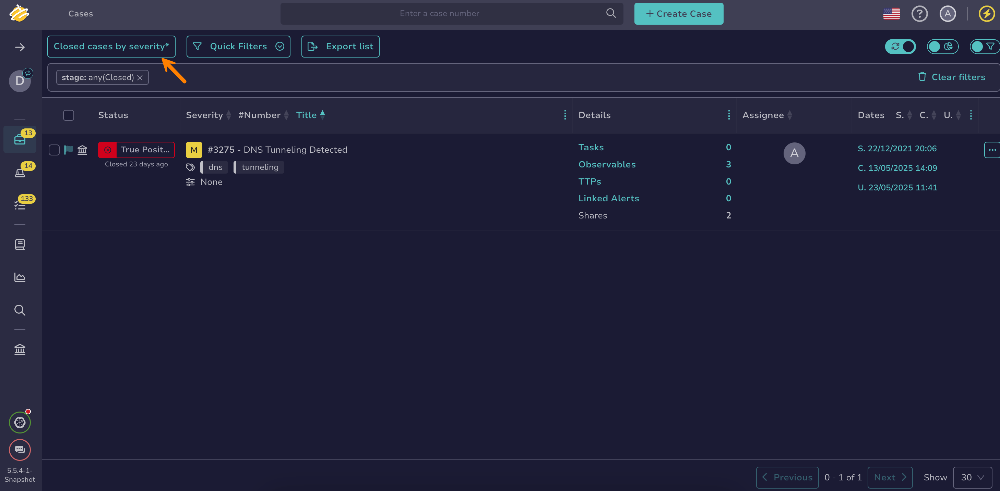

# Delete a Custom View

This topic provides step-by-step instructions for deleting a custom [view](create-a-custom-view.md) in TheHive.

!!! note "Default view"
    You can't delete the *Default* view.

!!! info "Beta feature available for filters and views"
    <!-- md:version 5.5.6 --> A beta feature to enhance user experience for filters and views is available for testing on lists of cases, alerts, tasks, and observables. For detailed instructions on how to activate this beta feature, see [Activate the Beta of Filters and Views](../../../user-guides/manage-user-settings.md#activate-the-beta-of-filters-and-views).

<h2>Procedure</h2>

1. Select the current view name followed by an asterisk (*\**).

    

2. Select **Manage views**.

3. Select :fontawesome-solid-ellipsis: next to the view you want to delete.

4. Select **Delete**.

<h2>Next steps</h2>

* [Create a Custom View](create-a-custom-view.md)
* [Update a Custom View](update-a-custom-view.md)