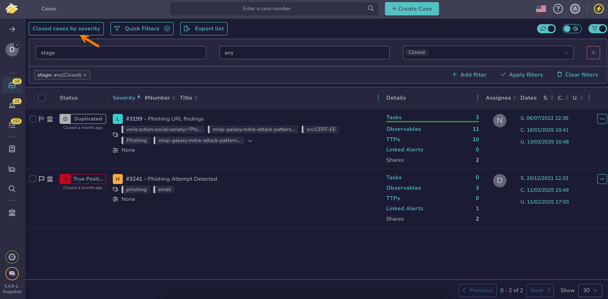

# Delete a Custom View

Delete a custom [view](about-views.md) from TheHive when it's no longer needed.

!!! note "Default view"
    You can't delete the *Default* view.

!!! danger "Shared views"
    <!-- md:version 5.6 --> If you delete a view that's [shared with the entire organization](change-visibility-custom-view.md#share-a-custom-view-with-the-entire-organization), it's permanently removed for all users in your organization.

<h2>Procedure</h2>

1. Select the current view name.

    

2. Select **Manage views**.

    

3. In the **Manage views** drawer, select :fontawesome-solid-trash: next to the view you want to delete.

4. Select **OK**.

<h2>Next steps</h2>

* [Create a Custom View](create-a-custom-view.md)
* [Update a Custom View](update-a-custom-view.md)
* [Rename a Custom View](rename-a-custom-view.md)
* [Change a Custom View Visibility](change-visibility-custom-view.md)