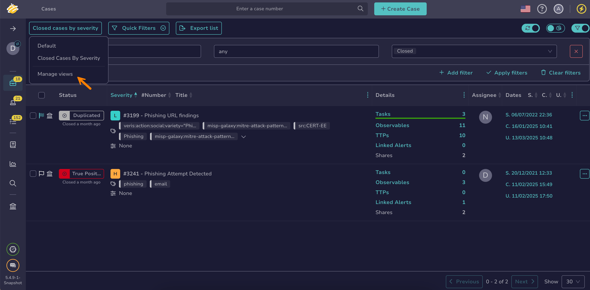

# Rename a Custom View

!!! warning "Shared views"
    <!-- md:version 5.6 --> If you rename a view that's [shared with the entire organization](change-visibility-custom-view.md#share-a-custom-view-with-the-entire-organization), your changes affect all users in your organization.

<h2>Procedure</h2>

1. Select the current view name.

    

2. Select **Manage views**.

    

3. In the **Manage views** drawer, select :fontawesome-solid-pen: next to the view you want to rename.

4. In the **Edit view** drawer, enter the new name.

5. Select **Save view**.

<h2>Next steps</h2>

* [Create a Custom View](create-a-custom-view.md)
* [Update a Custom View](update-a-custom-view.md)
* [Delete a Custom View](delete-a-custom-view.md)
* [Change a Custom View Visibility](change-visibility-custom-view.md)
