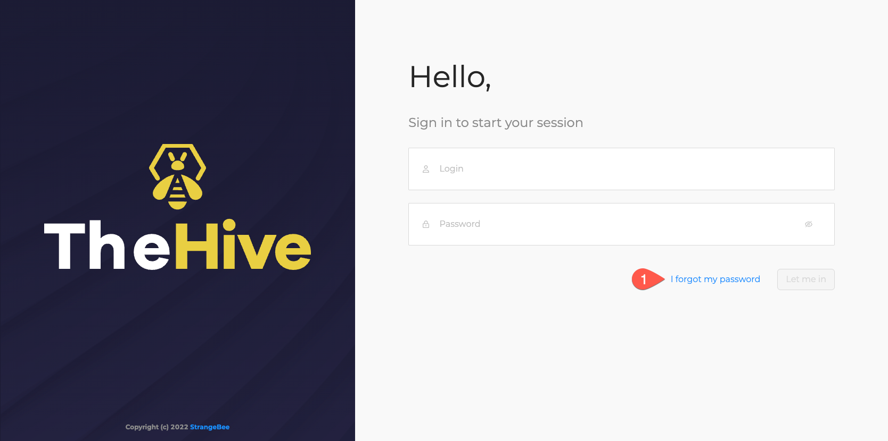
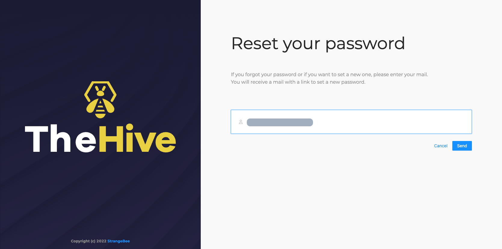
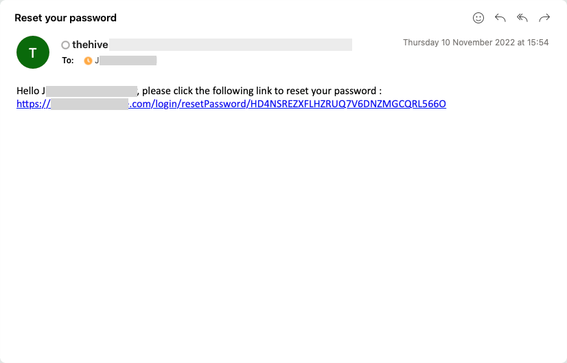

# How to Reset my Password

I forgot my password

If TheHive is connected to a SMTP server, as a user, you can change your password.

1. On the login page of TheHive, click the *I forgot my password* button

    <figure markdown>
    { width="500" }
    </figure>

2. Enter your email address and click *send*

    <figure markdown>
    { width="500" }
    </figure>

3. You should received an email including a magic link to change your password

    <figure markdown>
    { width="500" }
    </figure>

4. Click on the link and change your password. You should be able to login again once updated.