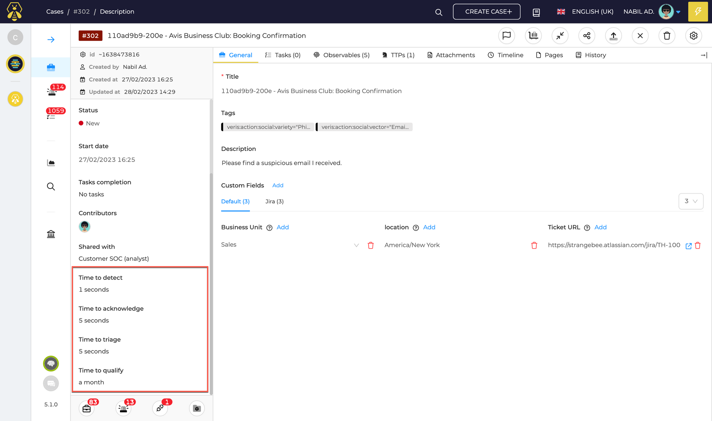
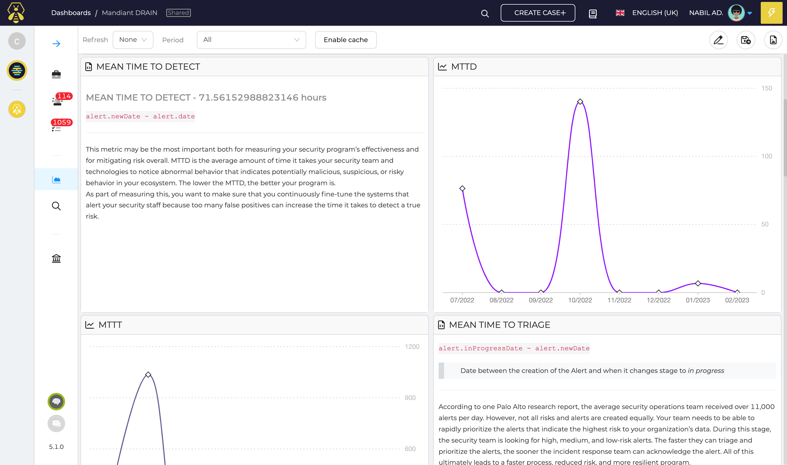

# Indicators
Since version 5.1, TheHive provides valuable insights into the time metrics of events and incidents, allowing you to track key performance indicators related to your security operations.
The support for mean time metrics has been added in dashboards, to make it easier for you to manage your operations and helps to identify areas that may require more attention or effort.

## List of indicators in Case and Alert

Each _Case_ and _Alert_ is defined by several time & date information. From this data, TheHive computes useful indicators displayed in the detailed view of each _Case_ and _Alert_.

!!! Tip ""

    ###  Time to Detect (TTD)

    From an alert: `alert.newDate - alert.date`

    From a case: `case.newDate - case.startDate`

    This is the amount of time between the date of the event (`alert.date`) and the alert creation date (`alert.newDate`).

    --- 

    _TTD is the amount of time it takes your security team and technologies to notice abnormal behavior that indicates potentially malicious, suspicious, or risky behavior in your ecosystem. The lower the TTD, the better your program is. As part of measuring this, you want to make sure that you continuously fine-tune the systems that alert your security staff because too many false positives can increase the time it takes to detect a true risk._
    
    (source: _[https://securityscorecard.com/blog/kpis-for-security-operations-incident-response/](https://securityscorecard.com/blog/kpis-for-security-operations-incident-response/)_)

    ###  Time to Triage (TTT)

    From an alert: `alert.inProgressDate - alert.newDate`

    From a case: `case.inProgressDate - case.newDate`

    This is the amount of time between the alert creation date (`alert.newDate`) and the date on which the alert becomes in progress (`alert.inProgressDate`).

    --- 

    _According to one Palo Alto research report, the average security operations team received over 11,000 alerts per day. However, not all risks and alerts are created equally. Your team needs to be able to rapidly prioritize the alerts that indicate the highest risk to your organization’s data. During this stage, the security team is looking for high, medium, and low-risk alerts. The faster they can triage and prioritize the alerts, the sooner the incident response team can acknowledge the alert. All of this ultimately leads to a faster process, reduced risk, and more resilient program._

    (source: _[https://securityscorecard.com/blog/kpis-for-security-operations-incident-response/](https://securityscorecard.com/blog/kpis-for-security-operations-incident-response/)_)

    ### Time to Qualify (TTQ) - _Equivalent to assessmentDuration_ 

    From an alert: `max(alert.importedDate, alert.closedDate) - alert.newDate`

    This is the amount of time between the alert creation date (`alert.newDate`) and the date on which the alert has been closed or imported (`alert.importedDate` or `alert.closedDate`).

    --- 

    _The triage process naturally leads to the qualification process. In some cases, your security operations team may determine that an alert qualifies to be moved to the incident response team. In some cases, this KPI overlaps with the meantime to acknowledge (MTTA) because the incident response team can’t start acknowledging and moving the research forward until the security operations team qualifies it._ 
    
    (source: _[https://securityscorecard.com/blog/kpis-for-security-operations-incident-response/](https://securityscorecard.com/blog/kpis-for-security-operations-incident-response/)_)

    ###  Time to Acknowledge (TTA) - _Equivalent to SLA_

    From an alert: `alert.inProgressDate - alert.date`

    From a case: `case.inProgressDate - case.startDate`

    This is the amount of time between the date of the event (`alert.date`) and the date on which the alert becomes in progress (`alert.inProgressDate`).

    --- 

    _Related to TTD, this metric tells you the amount of time it takes your security operations and incident response team to acknowledge an alert before they begin doing an investigation. This is the reason you want the MTTD to be lower. The better the alerts your team gets, the sooner they can acknowledge real threats. You want to keep the MTTA as low as possible as part of creating KPIs._ 
    
    (source: _[https://securityscorecard.com/blog/kpis-for-security-operations-incident-response/](https://securityscorecard.com/blog/kpis-for-security-operations-incident-response/)_)

    ### Time to Resolve (TTR)

    From a case or an alert: `case.endDate - min(alert.inProgress, case.inProgress)`

    This is the amount of time between the team start to work on incident (`alert.inProgressDate` or `case.inProgressDate`) and the end of the incident (`case.endDate`).

    --- 

    _Once your team acknowledges the threat, they need to resolve it. MTTI focuses on the amount of time it takes the incident response team to get from the investigation to the recovery step. This is another KPI that you want to have a low number. The resolution may be that the alert was a false positive or it may be that the team had to eradicate a threat and recover a system. In either case, the sooner that the team can complete all the necessary resolution steps, the stronger your cybersecurity posture is._

    (source: _[https://securityscorecard.com/blog/kpis-for-security-operations-incident-response/](https://securityscorecard.com/blog/kpis-for-security-operations-incident-response/)_)

With the new time metrics indicators, you can now have visibility into the detection, acknowledgement, and triage times for each case and alert, providing a clearer understanding of your incident response processes.

<figure markdown>
  { width="600" }
</figure>

## Use KPIs in Dashboards
Using _Mean Time To_ metrics in dashboards can building dashboards with useful KPIs to understand your efficiency and identify areas that may require more attention or effort.

<figure markdown>
  { width="600" }
</figure>
