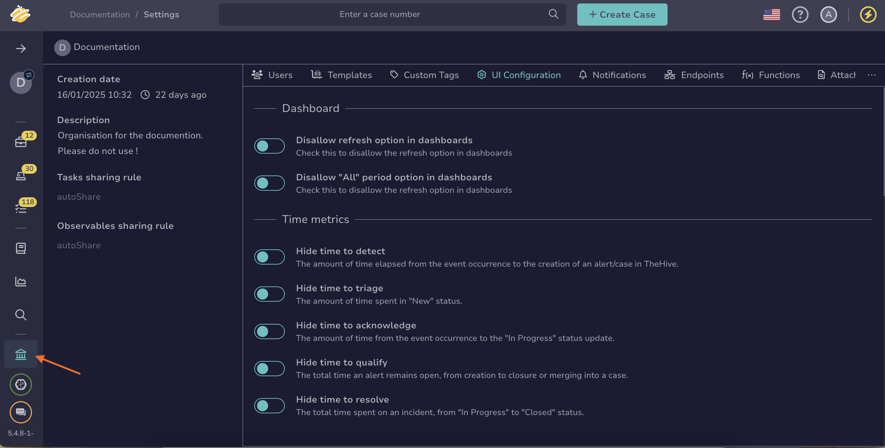
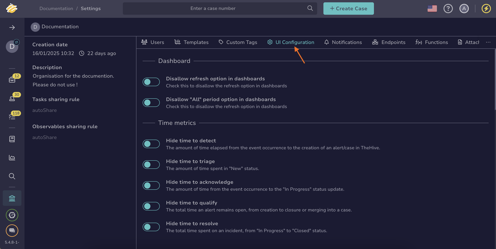

# How to Hide Key Performance Indicators

This topic provides step-by-step instructions for hiding one or several key performance indicators for [cases](../analyst-corner/cases/about-cases.md) and [alerts](../analyst-corner/alerts/about-alerts.md) in TheHive.

By default, all indicators are displayed in case and alert descriptions. Since version 5.4, you can hide some or all indicators if they are not useful or could be misleading for your organization.

If you want to know more about the key performance indicators available in TheHive, refer to the [About Key Performance Indicators](about-key-performance-indicators.md) topic.

!!! warning "Required permissions for managing KPIs display"
    Only users with an admin-type profile that has the `manageConfig` permission can manage the display of key performance indicators in case and alert descriptions in TheHive.

## Procedure

1. Go to the **Organization** view from the sidebar menu.

    Image

2. Select the **UI Configuration** tab.

    Image

3. Move through the **Time metrics** section.

4. Turn on the toggles for the indicators you want to hide in case and alert descriptions.

5. Select **Confirm**.

## Next steps

* [Measure Case Management Performance](measure-case-management-performance.md)
* [Measure Alert Management Performance](measure-alert-management-performance.md)