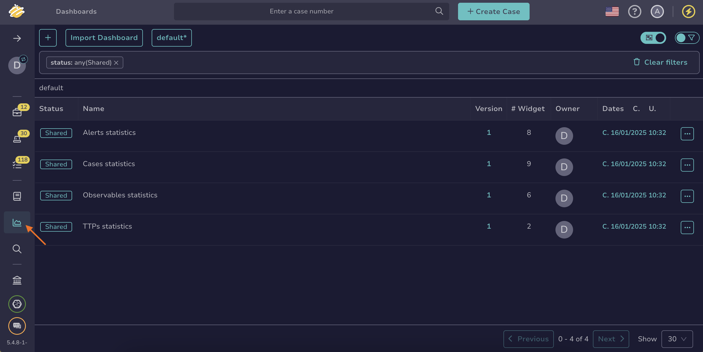
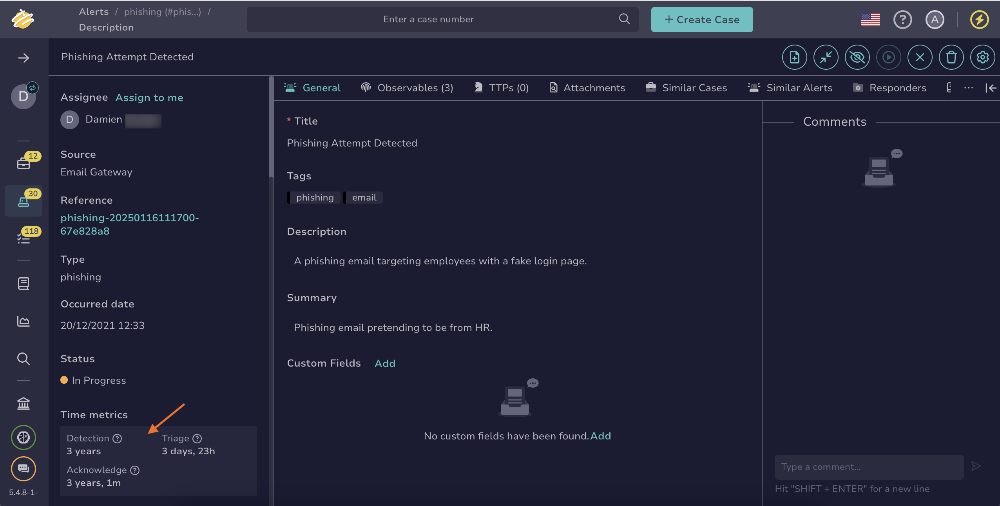

# How to Measure Alert Management Performance

This topic provides step-by-step instructions for measuring alert management performance in TheHive.

You can measure alert management performance [for all alerts in your organization](#measure-the-performance-of-all-alerts-in-your-organization) or [a specific case](#measure-the-performance-of-a-specific-alert).

If you want to know more about the key performance indicators (KPIs) available in TheHive, refer to the [Key Performance Indicators](key-performance-indicators.md) topic.

!!! info "Automated actions"
    If alerts are created or updated through automated actions (API, functions, or external services), some indicators may be identical or very close in value, especially if multiple operations occur within the same second.

## Measure the performance of all alerts in your organization

{!includes/dashboard-access.md!}

1. Go to the **Dashboards** view from the sidebar menu.

    

2. Select a dashboard related to alerts.

3. Select :fontawesome-solid-pen:.

4. Select **Edit** on the section where you want to add your alert management KPIs.

5. Select any value that begins with *timeTo* to any **Filters** box.

{!includes/units-time-to.md!}

## Measure the performance of a specific alert

1. [Locate the case you want to check](../analyst-corner/cases/search-for-cases/find-a-case.md).

2. In the alert description, move through the **Time metrics** section in the left pane.

    

3. Review the available indicators for your alert.

<h2>Next steps</h2>

* [Measure Case Performance](measure-case-management-performance.md)