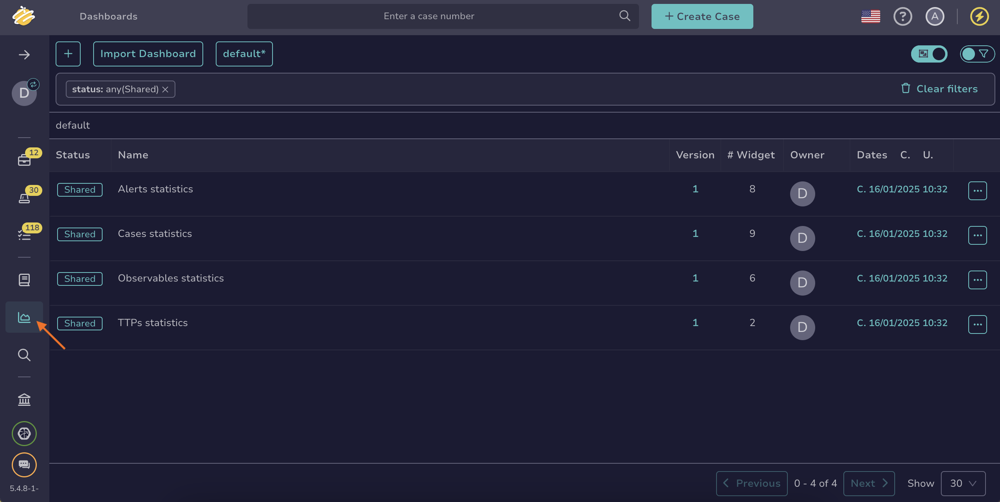

# How to Measure Case Management Performance

This topic provides step-by-step instructions for measuring case management performance in TheHive.

You can measure case management performance [for all cases in your organization](#measure-the-performance-of-all-cases-in-your-organization) or [a specific case](#measure-the-performance-of-a-specific-case).

If you want to know more about the key performance indicators (KPIs) available in TheHive, refer to the [About Key Performance Indicators](about-key-performance-indicators.md) topic.

## Measure the performance of all cases in your organization

{!includes/dashboard-access.md!}

1. Go to the **Dashboards** view from the sidebar menu.

    

2. Select a dashboard related to cases.

3. Select .

4. Select **Edit** on the section where you want to add your case management KPIs.

5. Select any value that begins with *timeTo* to any **Filters** box.

## Measure the performance of a specific case

1. [Locate the case you want to check](../analyst-corner/cases/search-for-cases/find-a-case.md).

2. In the case description, move through the **Time metrics** section in the left pane.

    

3. Review the available indicators for your case.

## Next steps

* [Evaluate Alert Performance](measure-alert-management-performance.md)

