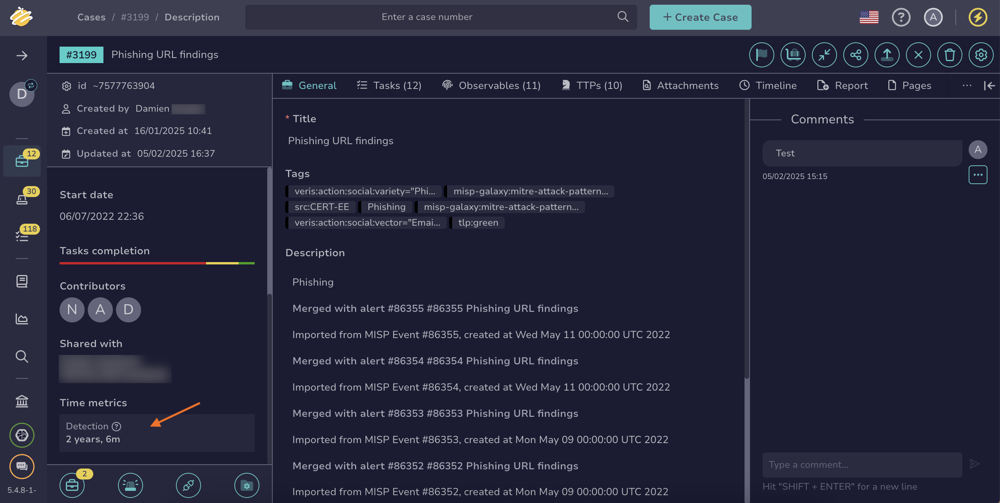

# Measure Case Management Performance

This topic provides step-by-step instructions for measuring case management performance in TheHive.

You can measure case management performance [for all cases in your organization](#measure-the-performance-of-all-cases-in-your-organization) or [a specific case](#measure-the-performance-of-a-specific-case).

If you want to know more about the key performance indicators (KPIs) available in TheHive, refer to the [Key Performance Indicators](key-performance-indicators.md) topic.

!!! info "Automated actions"
    If cases are created or updated through automated actions (API, functions, or external services), some indicators may be identical or very close in value, especially if multiple operations occur within the same second.

## Measure the performance of all cases in your organization

<!-- md:permission `manageDashboard` -->

1. Go to the **Dashboards** view from the sidebar menu.

    

2. Select a dashboard related to cases.

3. Select :fontawesome-solid-pen:.

4. Select **Edit** on the section where you want to add your case management KPIs.

5. Select any value that begins with *timeTo* to any **Filters** box.



## Measure the performance of a specific case

Two options are available to measure a case's performance:

**In a case description:**

1. [Locate the case you want to check](../analyst-corner/cases/search-for-cases/find-a-case.md).

2. In the case, move through the **Time metrics** section in the left pane.

    

3. Review the available indicators for your case.

**In a case report template:**

<!-- md:permission `manageCaseReportTemplate` -->

1. 

2. 

3. 

4. Select a case report template.

5. Select :fontawesome-solid-pen: on the section where you want to add your case management KPIs.

6. Select **Add variable**.

7. Select any value that begins with *timeTo*.



<h2>Next steps</h2>

* [Measure Alert Performance](measure-alert-management-performance.md)