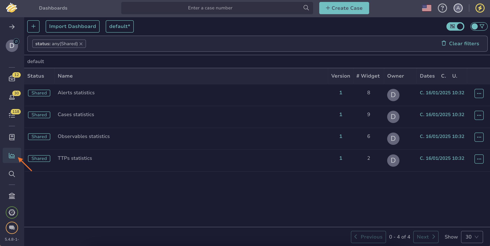
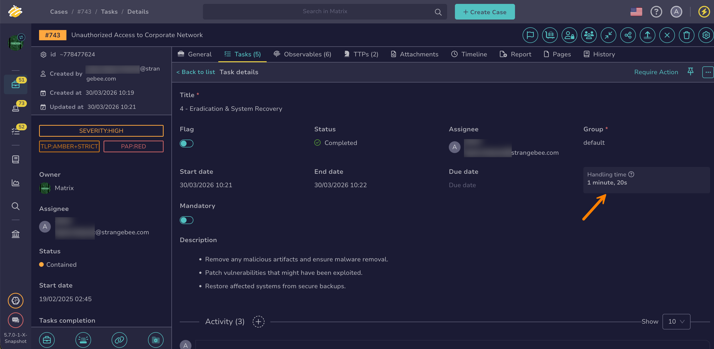

# Measure Task Management Performance

<!-- md:version 5.7 -->

Measure task management performance in TheHive [for all tasks in your organization](#measure-the-performance-of-all-tasks-in-your-organization) or [for a specific task](#measure-the-performance-of-a-specific-task) using the [Time to handle metric](key-performance-indicators.md#time-to-handle-tasks).

!!! note "Completed tasks only"
    Handling time is only available for tasks with the status *Completed*.

## Measure the performance of all tasks in your organization

<!-- md:permission `manageDashboard` -->

1. Go to the **Dashboards** view from the sidebar menu.

    

2. Select a dashboard related to tasks.

3. Select :fontawesome-solid-pen:.

4. Select **Edit** on the section where you want to add your task management KPI.

5. Select any value that begins with *timeToHandle* to any **Filters** box.



## Measure the performance of a specific task

1. [Locate the task you want to check](../analyst-corner/tasks/search-for-tasks/find-a-task.md).

2. In the task, review the **Handling time** indicator.

    

<h2>Next steps</h2>

* [Measure Case Performance](measure-case-management-performance.md)
* [Measure Alert Performance](measure-alert-management-performance.md)