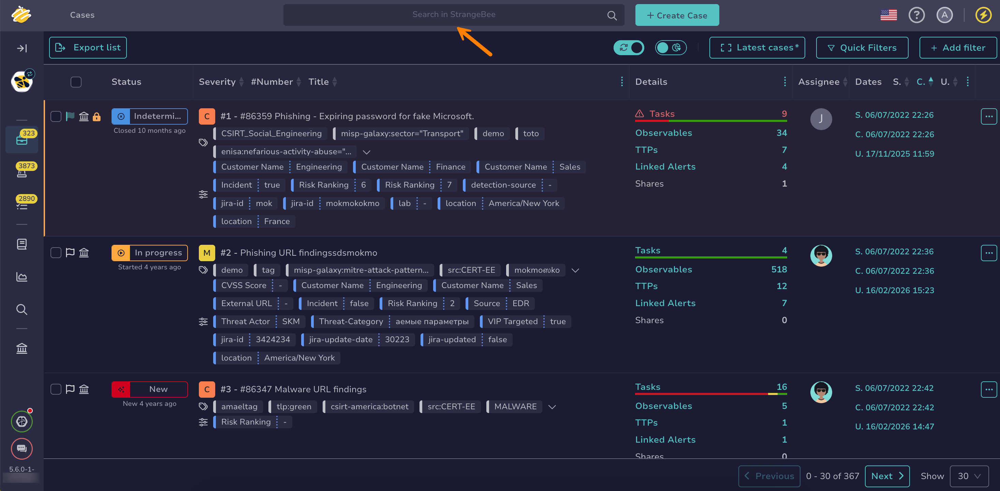
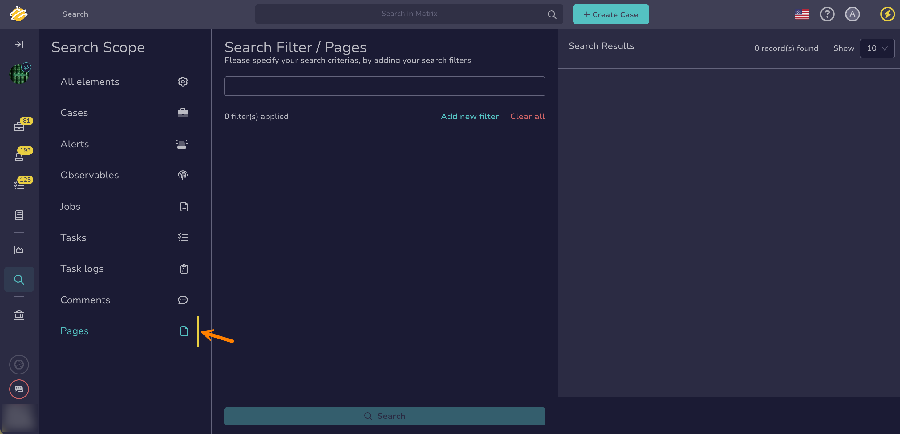

# Find a Page

<!-- md:version 5.8 -->

Search for [Knowledge Base pages](about-knowledge-base.md) and [case pages](about-case-pages.md) in TheHive using the search bar or the Global Search feature.

## Method 1: Search bar

*Quick searches without filters.*

1. In the search bar at the top of the page, enter your search text.

    

    

    

2. Select a result from the list, or choose **All results** to view the full set of matches.

!!! note "Refine results"
    The search bar searches across all element types—cases, alerts, observables, tasks, task logs, jobs, comments, and pages—but it doesn't support filters.

    Use the [Global Search feature](#method-2-global-search-feature) when you need to refine results more precisely.

---

## Method 2: Global Search feature

*Complex searches with filters.*

1. Go to the **Global Search** view from the sidebar menu.

    

2. Select the **Pages** item on the **Search scope** pane.

    

    !!! note "All elements"
        Select the **All elements** item for a comprehensive tool-wide overview that includes all entity types, such as cases, alerts, observables, jobs, tasks, task logs, comments, and pages. Use this option to analyze cross-linked information or to conduct a detailed investigation.

3. Enter the keywords you want to search for in the search box displayed by default.

    

    

4. 

5. 

<h2>Next steps</h2>

* [Share a Case Page](share-a-case-page.md)
* [Share a Knowledge Base Page](share-a-knowledge-base-page.md)
* [Create a Case Page](create-a-case-page.md)
* [Create a Knowledge Base Page](create-a-knowledge-base-page.md)
