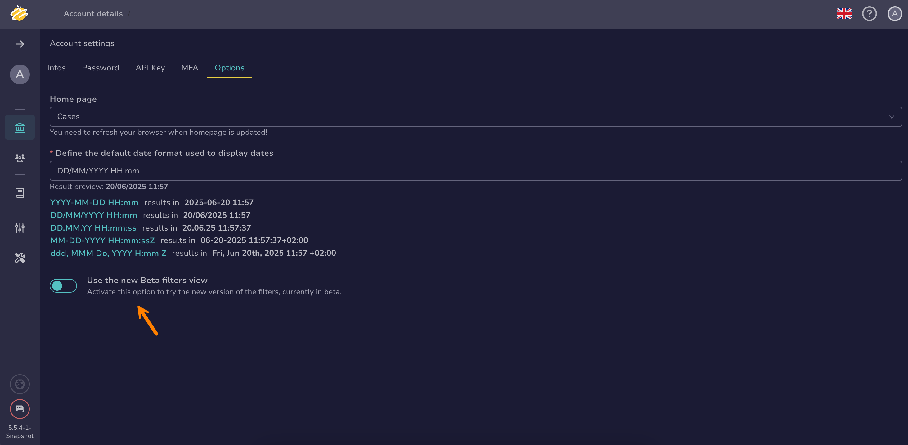

# How to Manage your Account Settings

This topic provides step-by-step instructions for managing the settings of your [user account](../user-guides/organization/configure-organization/manage-user-accounts/about-user-accounts.md) in TheHive.

## Edit your avatar

1. {!includes/user-symbol-go-to.md!}

2. Select **Settings**.

3. In the **Infos** tab, select the avatar, then select a new image in PNG or JPG format. The file must be smaller than 500 KB.

4. Select **Confirm**.

## Edit your name

1. {!includes/user-symbol-go-to.md!}

2. Select **Settings**.

3. In the **Infos** tab, edit your name.

4. Select **Confirm**.

## Edit your email address

1. {!includes/user-symbol-go-to.md!}

2. Select **Settings**.

3. In the **Infos** tab, edit your email address. The email address is used to send you notifications and password-related information.

4. Select **Confirm**.

## Manage your API key

1. {!includes/user-symbol-go-to.md!}

2. Select **Settings**.

3. In the **API key** tab, select **Renew**, **Reveal**, or **Revoke**, depending on the action you want to take.

4. Select **Confirm**.

## Activate multi-factor authentication (MFA)

Use this procedure to add an extra layer of security to your account.

1. {!includes/user-symbol-go-to.md!}

2. Select **Settings**.

3. In the **MFA** tab, follow the on-screen instructions to activate multi-factor authentication.

## Edit your homepage

1. {!includes/user-symbol-go-to.md!}

2. Select **Settings**.

3. In the **Options** tab, select the page you want to use as your homepage.

4. Select **Confirm**.

## Edit the default date format

1. {!includes/user-symbol-go-to.md!}

2. Select **Settings**.

3. In the **Options** tab, select the date format you want to use.

4. Select **Confirm**.

## Activate the beta of filters and views

<!-- md:version 5.5.5 -->

A beta feature to enhance user experience for [filters](./analyst-corner/about-filtering-and-sorting.md) and [views](./analyst-corner/about-views.md) is available for testing on lists of cases, alerts, tasks, and observables.

!!! note "Views persistence"
    Use this beta feature for one-time testing only:

    * When you activate the beta for the first time, views from the current version are automatically copied to the beta. However, if you deactivate and then reactivate the beta, views won't be copied again.
    * Views you create while using the beta won't be retained in version 5.6 and will be lost if you deactivate the beta.

1. {!includes/user-symbol-go-to.md!}

2. Select **Settings**.

3. In the **Options** tab, turn on the **Use the new beta filters view** toggle.

    

4. Select **Confirm**.

<h2>Next steps</h2>

* [Log Out of your Account](log-out.md)
* [Switch Organizations](switch-organizations.md)
* [Change your Account Theme](change-account-theme.md)
* [Manage your Password](manage-password.md)
* [View your Account Profile and Permissions](view-permissions.md)