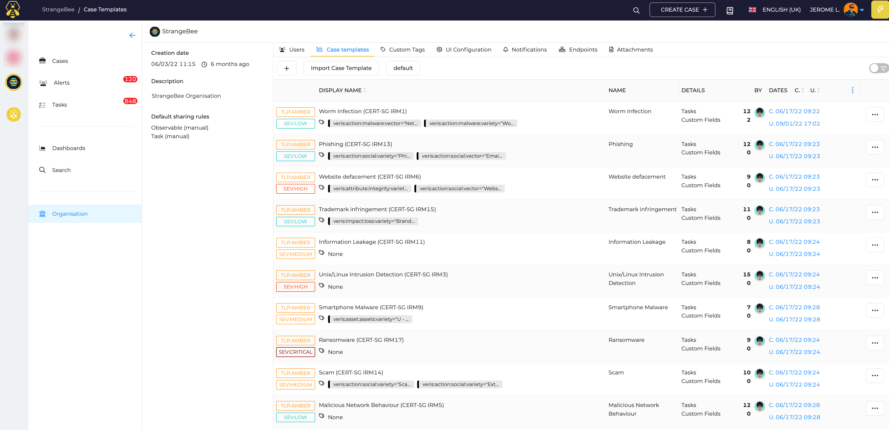
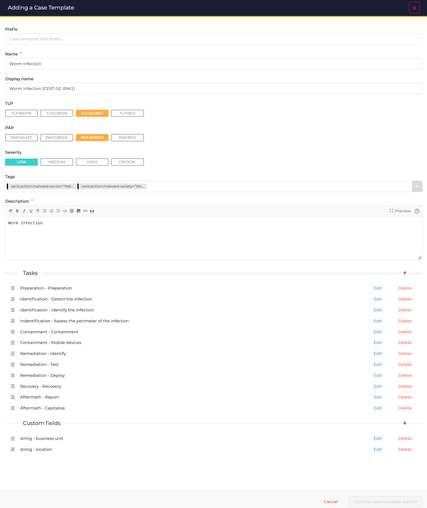

# Define Case templates

This section contains the Case templates you prepare for your organisation.

## List of Case Templates

Access to the list by opening the *Organisation* menu, and the *Case templates* tab.

<figure markdown>
  { width="450" }
  <figcaption>List of Case templates</figcaption>
</figure>

Click the :fontawesome-regular-square-plus: button to create a new *Case template*.

## New Case template

<figure markdown>
  { width="450" }
  <figcaption>Create a Case template</figcaption>
</figure>

### Configuration parameters

Prefix
  : String that will be prepended to the title of a Case when created with this template

Name
  : Name of the Case template. Used to identify the Case template with the API

Display Name
  : Name of the Case template displayed in the UI

TLP
  : Default TLP of the Case when created with this template

PAP
  : Default PAP of the Case when created with this template

Severity
  : Default Severity of the Case when created with this template

Tags
  : List of tags that will be added to the Cases created with this template

Description
  : Default description of the Case template. Default description of Cases created with this template if not modified. 

Tasks
  : Add tasks to the templates. They will will automatically added to the Case when created with this template

Custom Fields
  : Add Custom fields to the template. 

## Import/Export