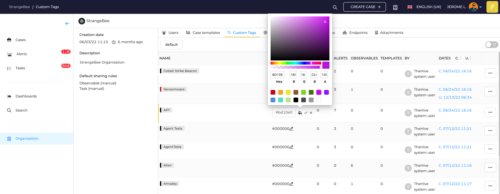

# Custom tags

*Custom tags* gathers all tags coming from *Alerts* of added to *Cases* or *Observables* that are not included in [Taxonomies](../../administration/taxonomies.md) added to TheHive, even if they are not activated.

<figure markdown>
  { width="600" }
  <figcaption>Custom tags</figcaption>
</figure>

The list shows statistics about the number of them found in *Cases*,*Alerts* or *Observables*.

## Configuration

* Names and colors can be adjusted for all Custom tags
* Each tag can also be deleted