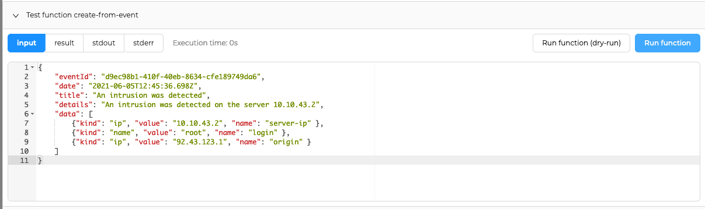

<!-- ---
hide:
  - navigation
--- -->

# *Functions*

!!! Info
    This feature is available with TheHive versions 5.1 and higher.

Functions enable you to integrate external applications directly into TheHive processing.

A Function is a piece of custom Javascript code that runs inside TheHive. The function can receive inputs from the outside, treat it and call TheHive APIs directly.

This can be used for instance to create alerts inside TheHive without a python glue service that transforms the data.

## Create a function

Let's imagine that when an event occurs in your system, you want to create an alert in TheHive. Your external system has its own schema for the events, something like:

!!! Example ""

    ```json
    {
        "eventId": "d9ec98b1-410f-40eb-8634-cfe189749da6",
        "date": "2021-06-05T12:45:36.698Z",
        "title": "An intrusion was detected",
        "details": "An intrusion was detected on the server 10.10.43.2",
        "data": [
            {"kind": "ip", "value": "10.10.43.2", "name": "server-ip" },
            {"kind": "name", "value": "root", "name": "login" },
            {"kind": "ip", "value": "92.43.123.1", "name": "origin" }
        ]
    }
    ```

This format is not the same as TheHive, so you need to transform the data to match TheHive alert format.

As an `org-admin`, you can create new functions for your organisation that can take this input, transform it into TheHive format and create an alert from it.

The code of the function would be something like this:

!!! Example ""

    ```javascript
    function handle(input, context) {
        const theHiveAlert = {
            "type": "event",
            "source": "my-system",
            "sourceRef": input.eventId,
            "title": input.title,
            "description": input.details,
            "date": (new Date(input.date)).getTime(),
            "observables": input.data.map(data => {
                // map event data kind to TheHive Observable type
                const dataType = data.kind === "ip" ? "ip": "other";
                return {
                    "dataType": dataType,
                    "data": data.value,
                    "tags": [`name:${data.name}`] // use a tag for the data name
                }
            })
        };
        // call TheHive APIs, here alert creation
        return context.alert.create(theHiveAlert);
    }
    ```

<figure markdown>
{ width="500" }
</figure>

A function can be in one of three modes:

- `Enabled`: The function will be executed when called
- `Disabled`: The function will not be executed when called
- `Dry-Run`: The function will be executed but no entity will be created or modified in TheHive. Entity creations will return `null` instead. This can be useful to test your integration before setting it live.

The creation page allows you to test your function and see what it would return once executed.
In `dry-run` mode, the function will be executed but no resource creation or modification will be executed.

<figure markdown>
{ width="500" }
</figure>

<figure markdown>
{ width="500" }
</figure>

## Call a function

Once saved, the function can then be called with an http call from your system:

!!! Example ""

    ```bash
    curl -X POST -H 'Authorization: Bearer $API_KEY' https://<thehive_url>/api/v1/function/<function_name> -H 'Content-Type: application/json' --data '
    {
        "eventId": "d9ec98b1-410f-40eb-8634-cfe189749da6",
        "date": "2021-06-05T12:45:36.698Z",
        "title": "An intrusion was detected",
        "details": "An intrusion was detected on the server 10.10.43.2",
        "data": [
            {"kind": "ip", "value": "10.10.43.2", "name": "server-ip" },
            {"kind": "name", "value": "root", "name": "login" },
            {"kind": "ip", "value": "92.43.123.1", "name": "origin" }
        ]
    }
    '
    ```

TheHive will take your input (the body of the http call), the definition of your function and execute the function with the input.
It will respond to the http call with the data returned by the function.

## Example: Create an alert from a Splunk alert

When creating a Splunk alert, you can define a [webhook as an action](https://docs.splunk.com/Documentation/Splunk/9.0.0/Alert/Webhooks). So when the alert is triggered the webhook is called with a payload. But the payload is defined by splunk and can't be changed.

It should look a bit like:

!!! Example ""

    ```json
    {
    "sid": "rt_scheduler__admin__search__RMD582e21fd1bdd5c96f_at_1659705853_1.1",
    "search_name": "My Alert",
    "app": "search",
    "owner": "admin",
    "results_link": "http://8afeb4633464:8000/app/search/search?q=%7Cloadjob%20rt_scheduler__admin__search__RMD582e21fd1bdd5c96f_at_1659705853_1.1%20%7C%20head%201%20%7C%20tail%201&earliest=0&latest=now",
    "result": {
        "_time": "1659705859.827088",
        "host": "8afeb4633464",
        "source": "audittrail",
        "sourcetype": "audittrail",
        "action": "edit_search_schedule_priority",
        "info": "granted",
        "user": "admin",
        "is_searches": "0",
        "is_not_searches": "1",
        "is_modify": "0",
        "is_not_modify": "1",
        "_confstr": "source::audittrail|host::8afeb4633464|audittrail",
        "_indextime": "1659705859",
        "_kv": "1",
        "_raw": "Audit:[timestamp=08-05-2022 13:24:19.827, user=admin, action=edit_search_schedule_priority, info=granted ]",
        "_serial": "1",
        "_si": [
        "8afeb4633464",
        "_audit"
        ],
        "_sourcetype": "audittrail",
        "_subsecond": ".827088"
    }
    }
    ```

To transform this splunk alert into a TheHive alert, a function like this can be used:

!!! Example ""

    ```javascript
    function handle(input, context) {
        const theHiveAlert = {
            "type": "splunk",
            "source": input.search_name,
            "sourceRef": input.result._serial,
            "title": `Splunk Alert triggered: ${input.search_name} by ${input.result.sourcetype}`,
            "description": `Alert created by splunk search '${input.search_name}:\n${input.result._raw}'`,
            "date": (new Date(parseFloat(input.result._time)*1000)).getTime(),
            "observables": [
                {"dataType": "hostname", "data": input.result.host},
                {"dataType": "other", "data": input.result.action, "message": "action"},
                {"dataType": "other", "data": input.result._raw, "message": "raw"}
            ]
        };
        return context.alert.create(theHiveAlert);
    }
    ```

In splunk, you will need to set the webhook url to TheHive function url.

