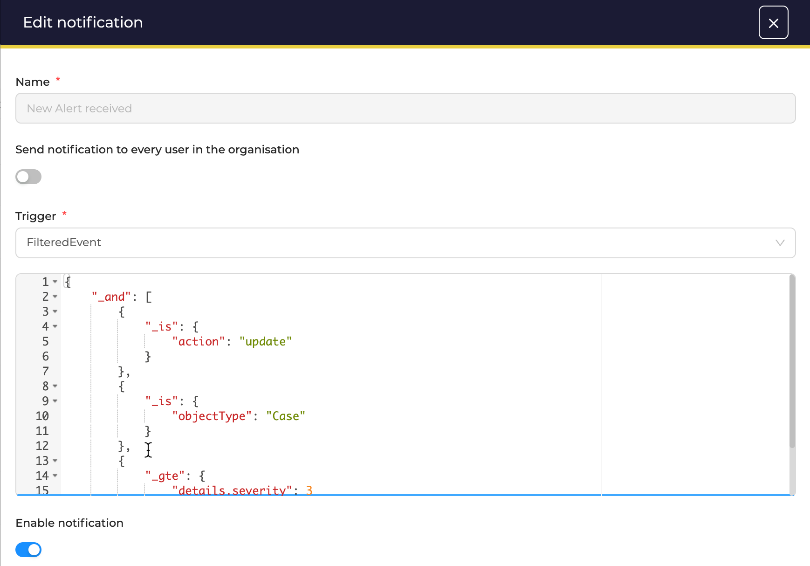

# How to write filtered events for notifications ?

<figure markdown>
  { width="500" }
  <figcaption>Filtered event example: "Case severity has been updated to High or Critical"</figcaption>
</figure>

Selecting “FilteredEvent” opens an empty field where we set our custom filter. The filters will apply to the audit of every actions that are happening in your organization. When there is a match, a notification is sent. 

!!! info
    We recommend reading this [blog post](https://blog.strangebee.com/leveraging-thehive5-notification-capabilities-2-2/) that introduces the capabilities of filtered events.

## Anatomy of an audit

An audit is presented as a json like this:

```json
{
  "_id": "~327684328",
  "_type": "Audit",
  "_createdBy": "director@movies.io",
  "_createdAt": 1694441999960,
  "action": "update",
  "requestId": "74dc37479904ebe7:3957d351:18a847d4266:-8000:109",
  "rootId": "~327925760",
  "details": {
    "status": "InProgress",
    "stage": "InProgress"
  },
  "objectId": "~327925760",
  "objectType": "Case",
  "object": {
    "_id": "~327925760",
    "_type": "Case",
    "_createdBy": "mia@movies.io",
    "_updatedBy": "director@movies.io",
    "_createdAt": 1693412835689,
    "_updatedAt": 1694441999230,
    "number": 34,
    "title": "Behind themselves watch price take. I probably single service. Develop fear hotel real.",
    "description": "***Description***",
    "severity": 3,
    "severityLabel": "HIGH",
    "startDate": 1693151602000,
    "tags": [
      "tagA"
    ],
    "flag": false,
    "tlp": 2,
    "tlpLabel": "AMBER",
    "pap": 1,
    "papLabel": "GREEN",
    "status": "InProgress",
    "stage": "InProgress",
    "assignee": "mia@movies.io",
    "customFields": [],
    "userPermissions": [],
    "extraData": {},
    "newDate": 1693412835673,
    "inProgressDate": 1694441998841,
    "timeToDetect": 261233673,
    "timeToTriage": 1029163168,
    "timeToAcknowledge": 1290396841,
    "customFieldValues": {}
  },
  "context": {
    "_id": "~327925760",
    "_type": "Case",
    "_createdBy": "mia@movies.io",
    "_updatedBy": "director@movies.io",
    "_createdAt": 1693412835689,
    "_updatedAt": 1694441999230,
    "number": 34,
    "title": "Behind themselves watch price take. I probably single service. Develop fear hotel real.",
    "description": "***Description***",
    "severity": 3,
    "severityLabel": "HIGH",
    "startDate": 1693151602000,
    "tags": [
      "tagA"
    ],
    "flag": false,
    "tlp": 2,
    "tlpLabel": "AMBER",
    "pap": 1,
    "papLabel": "GREEN",
    "status": "InProgress",
    "stage": "InProgress",
    "assignee": "mia@movies.io",
    "customFields": [],
    "userPermissions": [],
    "extraData": {},
    "newDate": 1693412835673,
    "inProgressDate": 1694441998841,
    "timeToDetect": 261233673,
    "timeToTriage": 1029163168,
    "timeToAcknowledge": 1290396841,
    "customFieldValues": {}
  },
  "organisation": {
    "organisationId": "~4169864",
    "organisation": "Pulp Fiction"
  }
}
```

Audit fields:

- `_id`: id of the audit
- `_type`: always `Audit`
- `_createdBy`: Author of the action
- `action`: nature of the action. Can be `create`, `update`, `delete`, `merge` or `invoke` (for functions)
- `requestId`: Id of the http request
- `details`: a json object that contains the changes made on the object 
- `objectId`: `_id` of the object that was impacted by the action
- `objectType`: `_type` of the object
- `object`: full description of the object (after the modification)
- `rootId`: `_id` of the top most object. For instance if a task is updated, this will be the `_id` of the case
- `context`: context of the audit. This depends on what object is updated / created.
- `organisation`: details about the organisation where this action happened

## Writing a filter

Filters must be JSON formatted and can use following operators:

* `_and`
* `_or`
* `_not`
* `_any`
* `_lt`
* `_gt`
* `_lte`
* `_gte`
* `_eq`
* `_is`
* `_startsWith`
* `_endsWith`
* `_between`
* `_in`
* `_contains`
* `_like`
* `_has`
* `_empty`

### Field selection

When targeting a field, you can use a `.` notation to walk inside the json object.

For instance `object.severity` will get the field severity in the json: 

```json
{
  "object": {
    "severity": 3
  }
}
```

### `_and`

```
{"_and": [
  { ... filterA },
  { ... filterB }
]}
```

Returns true when all filters (filterA and filterB) return true

### `_or`

```
{"_or": [
  { ... filterA },
  { ... filterB }
]}
```

Returns true when one filters (filterA or filterB) return true

### `_not`

```
{"_not": {... filterA} }
```

Inverse the result of filterA

### `_any`

```json
{  "_any": "" }
```

Returns always true, useful for testing

### `_lt`, `_gt`, `_lte`, `_gte`

```json
{ "_lt": { "foo" : 42 } }
```

Returns true when field `foo` is strictly lower than `42`

### `_eq`, `_is`

`_eq` is an alias for `_is`

```json
{ "_eq": { "foo": 42 } }
```

Returns true when field `foo` is equal to `42`.

```json
{ "_eq": { "foo": "LOW" } }
```

Returns true when field `foo` is equal to `"LOW"`.

Also works with arrays:

```json
{ "_eq": { "tags": ["foo", "bar"] } }
```

Returns true when field `tags` will be equal to `["foo", "bar"]`

### `_startsWith`, `_endsWith`

```json
{ "_startsWith": { "foo": "LOW" } }
```

Check that field `foo` starts with string `"LOW"`

### `_like`

```json
{ "_like": { "foo": "*ice" } }
```

Returns true when field `foo` ends with `"lce"`

```json
{ "_like": { "foo": "ali*" } }
```

Returns true when field `foo` starts with `"ali"`

```json
{ "_like": { "foo": "*lce*" } }
```

Returns true when field `foo` contains with `"lce"`


### `_between`

```json
{ "_between": { "_field": "foo", "_from": 0, "_to": 2 } }
```

Check that field `foo` is between `0` and `2` (`_from <= value < _to`). Only works when `foo` is a number

### `_in`

```json
{ "_in": { "_field": "foo", "_values": ["foo", "bar"] } }
```

Checks that field `foo` is either `foo` or `bar`.

This also works with numbers:

```json
{ "_in": { "_field": "foo", "_values": [1, 42] } }
```

`_in` can also be used when the field is an array:

```json
{ "_in": { "_field": "tags", "_values": ["foo", "bar"] } }
```

```
{"tags": ["foo"] } ==> true
{"tags": ["bar", "baz"] } ==> true
{"tags": ["alice", "bob"] } ==> false
```

### `_contains`

```json
{ "_contains": { "foo": "LOW" } }
```

Check that field `foo` contains the value `"LOW"`. This works with string and arrays of string.

```
{"foo": "LOWER" } ==> true
{"foo": ["bar", "LOW"] } ==> true
{"foo": ["bar", "LOWER"] } ==> false
```

### `_has`

```json
{ "_has": "foo" }
```

Returns true when json object has a field named `foo`

### `_empty`

```json
{ "_empty": "foo" }
```

Returns true when field `foo` is either `[]` or `""` or `null`.

It will return false if the field is not defined. For this use case, use `{"_not": {"_has": "foo" } }`

## Examples

- An alert is closed but no assignee was defined

```json
{
    "_and": [
        {
            "_is": {
                "objectType": "Alert"
            }
        },
        {
            "_is": {
                "details.stage": "Closed"
            }
        },
        {
            "_not": {
                "_has": "object.assignee"
            }
        },
        {
            "_not": {
                "_has": "details.assignee"
            }
        }
    ]
}
```

- An observable was updated with a report from the analyzer `Crt_sh_Transparency_Logs_1_0`

```json
{
    "_and": [
        {
            "_is": {
                "action": "update"
            }
        },
        {
            "_is": {
                "objectType": "Observable"
            }
        },
        {
            "_has": "details.reports.Crt_sh_Transparency_Logs_1_0"
        }
    ]
}
```

- Responder has finished

```json
{
    "_and": [
        {
            "_is": {
                "action": "update"
            }
        },
        {
            "_is": {
                "objectType": "Action"
            }
        },
        {
            "_or": [
                {
                    "_is": {
                        "details.status": "Success"
                    }
                },
                {
                    "_is": {
                        "details.status": "Failure"
                    }
                }
            ]
        }
    ]
}
```

- Case is updated with a status `TruePositive` or `FalsePositive` and the custom field `business-unit` is either `Sales` or `Marketing`

```json
{
    "_and": [
        {
            "_is": {
                "action": "update"
            }
        },
        {
            "_is": {
                "objectType": "Case"
            }
        },
        {
            "_or": [
                {
                    "_is": {
                        "details.status": "TruePositive"
                    }
                },
                {
                    "_is": {
                        "details.status": "FalsePositive"
                    }
                }
            ]
        },
        {
            "_or": [
                {
                    "_is": {
                        "object.customFieldValues.business-unit": "Sales"
                    }
                },
                {
                    "_is": {
                        "object.customFieldValues.business-unit": "Marketing"
                    }
                }
            ]
        }
    ]
}
```

- The analyzer `EmlParser_2_1` finishes with a Success
```json
{
    "_and": [
        {
            "_is": {
                "objectType": "Job"
            }
        },
        {
            "_is": {
                "object.analyzerName": "EmlParser_2_1"
            }
        },
        {
            "_is": {
                "object.status": "Success"
            }
        }
    ]
}
```
