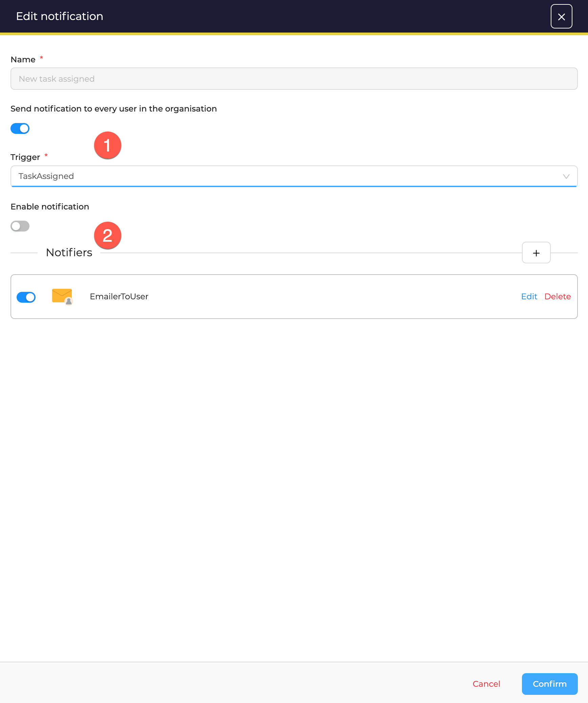
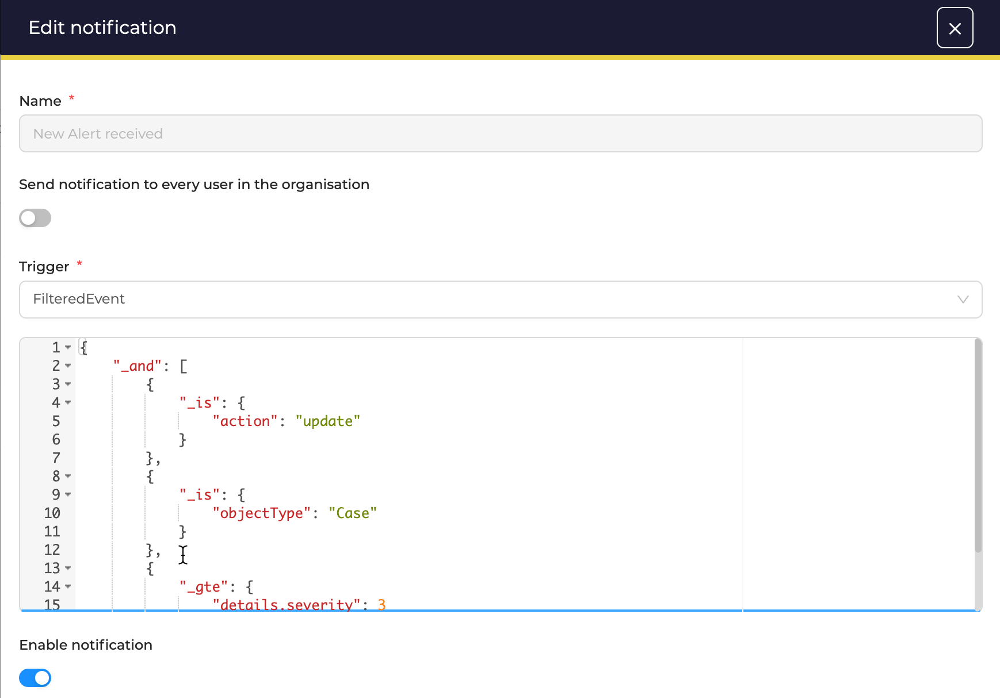

# Notifications

A notification, is a described by:

1. A *Trigger*
2. One or more *Notifiers*

<figure markdown>
  { width="450" }
  <figcaption>Notification</figcaption>
</figure>

## Triggers

Each notification is associated to *only* one trigger. TheHive comes with several predefined triggers on *Cases*, *Alerts*, *Tasks*, *Observables* and *Jobs*. Custom triggers can also be defined with *FilteredEvent*.

Another trigger let you run notifications on **any** event when selecting *AnyEvents*.

##### Triggers on Cases

* **CaseClosed**: Run an action when closing a *Case*
* **CaseCreated**: Run an action when a *Case* is created
* **CaseShared**: Run an action when a *Case* is shared

##### Triggers on Alerts

* **AlertCreated**: Run an action when an *Alert* is created
* **AlertImported**: Run an action when an *Alert* in imported (*a Case is created from an Alert or an Alert is attached to an existing Case*)

##### Triggers on Jobs

* **JobFinished**: Run an action when a *Job* is terminated, with *success* or *failure*

##### Triggers on Observables

* **ObservableCreated**: Run an action when an *Observable* is created

##### Triggers on Tasks

* **LoginMyTask**: Run an action when a *Task* gain a new *Log*
* **TaskAssigned**: Run an action when a *Task* is assigned, or the assignee is updated
* **TaskClosed**: Run an action when a *Task* is closed

##### Filtered Event

When selecting *FilteredEvent*, TheHive lets you write a structured JSON filter. This filter aims to match particular events in the application that will trigger one or more actions described by *notifiers*.

<figure markdown>
  { width="500" }
  <figcaption>Filtered event example: "Case severity has been updated to Hight or Critical</figcaption>
</figure>

Learn how to write filtered events and find more example in the [dedicated page](./filteredevents.md).

## Notifiers

Several types of *Notifiers* are available in TheHive:

* **EmailToUser**: send an email to *all* [users in the current Organisation](./email-to-users.md)
* **EmailToAddr**: send an email to [a specific email address](./email-to-addr.md)
* **HTTP Request**: send data to a chosen [HTTP endpoint](./http-request.md)
* **Mattermost**: send data to a chosen [Mattermost endoint](./mattermost.md)
* **Slack**: send data to a chosen [Slack endpoint](./slack.md)
* **Webhook**: send data to a chosen [webhook endpoint](./webhook.md)
* **Kafka**: send data to a chosen [Kafka queue](./kafka.md)

Two others, are more dedicated to run *Actions*:

* **RunAnalyzer**: run [selected Analyzers](./analyzers.md)
* **RunResponder**: run [selected Responders](./responders.md)