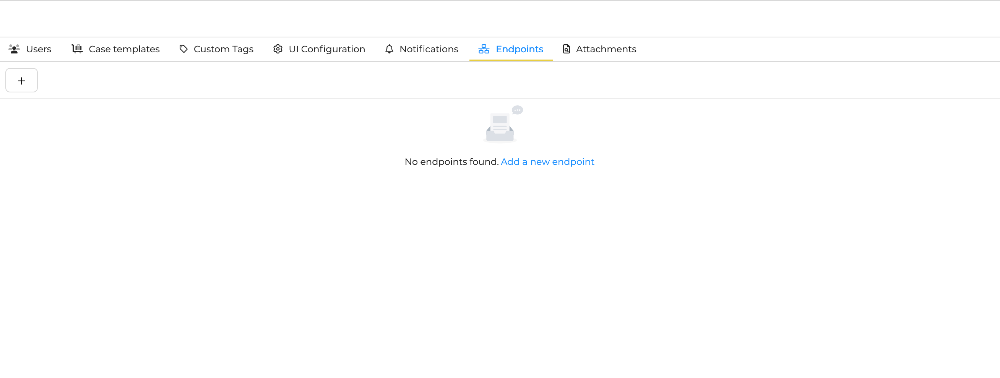
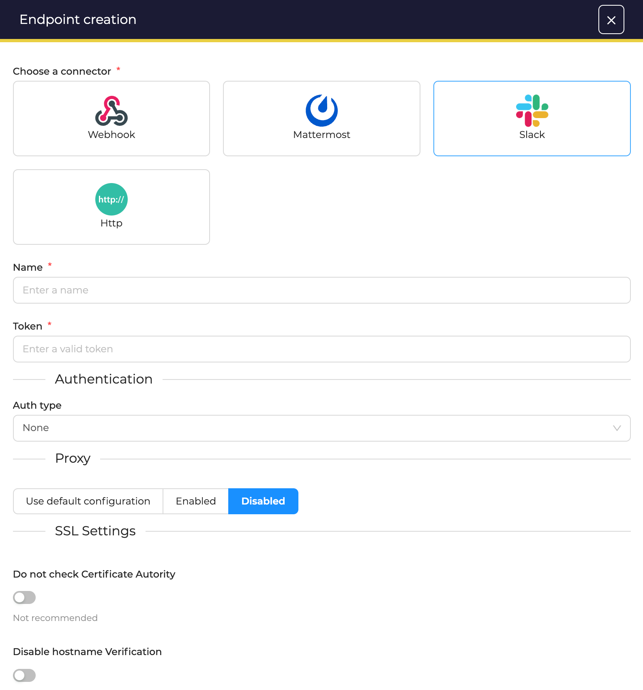
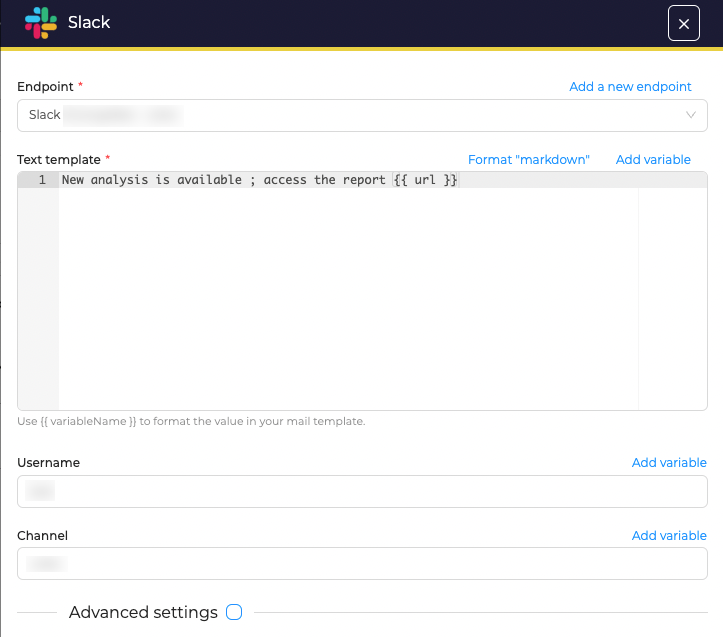
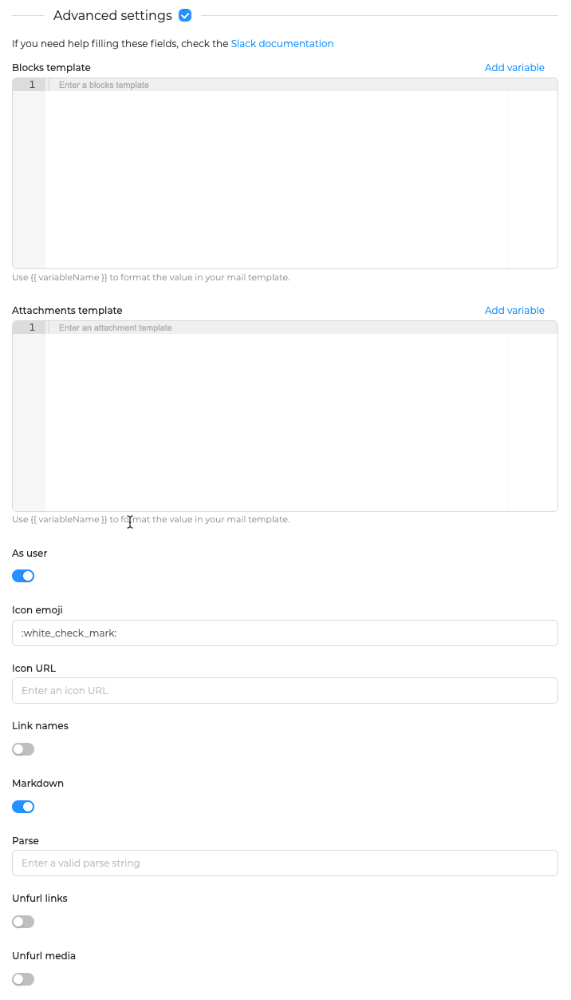

# Send notifications to Slack channels

Using Slack as *Notifier* requires to create at least one endpoint. This endpoint defines how TheHive will connect to Slack.

## Create an enpoint
In the *Organsation* configuration view, open the *Endpoints* tab. Then, click on the :fontawesome-regular-square-plus: button to create a new *Notifier*. 

<figure markdown>
  { width="500" }
</figure>

### Enpoint configuration
Choose *Slack* and complete required information.

<figure markdown>
  { width="500" }
</figure>

* **Name**: give a unique name to the endpoint
* **Token**: specify the token to use to connect to the service
* **Auth Type**: Use *Basic authentication* to connect to this endpoint, or use *Key* or *Bearer* method
* **Proxy settings**: choose to use a web proxy to connect to this endpoint
* **SSL settings**: disable Certificate Authority checking and/or checks on hostnames

Then, click **confirm** to create the endpoint.

## Notification configuration
When creating a *Notification* select *Slack* as *Notifier* and complete the form.

<figure markdown>
  { width="500" }
</figure>

TheHive uses [Handlebars](https://handlebarsjs.com) to let you build templates with input data, and this can be used in most of all fields of the form:

* **Endpoint**: choose the endpoint to use
* **Username**: choose a username. Click on *add variable* if you want to use an information from the input data. This will override the default username configured in the endpoint
* **Channel**: choose the target channel on Mattermost to send data to. Click on *add variable* if you want to use an information from the input data. This will override the default channel configured in the endpoint
* **Template**:
    * Available format are: *JSON*, *Markdown* and *Plain text* 
    * Click *Add variable* to select a variable to insert in the template

Then click **confirm** to register this *Notifier*.

## Advanced settings

<figure markdown>
  { width="500" }
</figure>