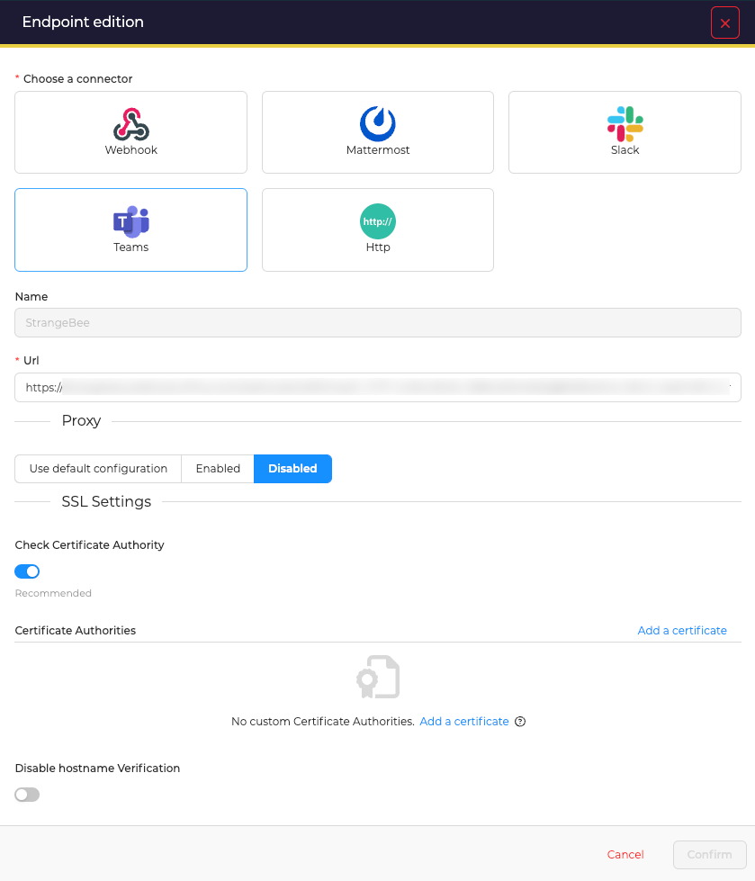
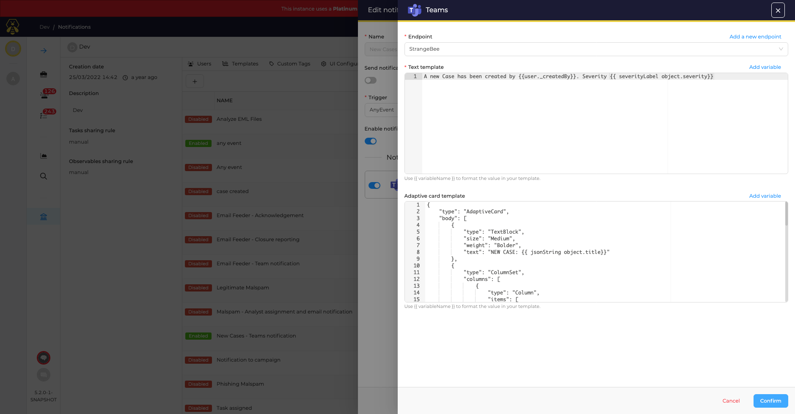

# Send notifications to a MS Teams channel

Using Microsoft Teams as *Notifier* requires to create at least one endpoint. This endpoint defines how TheHive will connect to MS Teams.

## Prepare Microsoft Teams

!!! Info 
    In this example, we are creating an *incoming webhook* in a dedicated channel named *thehive*.

<video width="600"  controls>
  <source id=mp4 src="../images/organisation-endpoints-msteams-configuration.mp4" type="video/mp4">
</video>


## Create an enpoint
In the *Organisation* configuration view, open the *Endpoints* tab. Then, click on the :fontawesome-regular-square-plus: button to create a new *Notifier*. 

<figure markdown>
  { width="500" }
</figure>

### Enpoint configuration
Choose *Teams* and complete required information.

<figure markdown>
  { width="500" }
</figure>

* **Name**: give a unique name to the endpoint
* **URL**: specify the URL to connect to your MS Teams ; This is the URL copied while creating the *incoming webhook* in Teams
* **Auth Type**: Use *Basic authentication* to connect to this endpoint, or use *Key* or *Bearer* method
* **Proxy settings**: choose to use a web proxy to connect to this endpoint
* **Certificate authorities**: add custom Certificate Authorities if required (PEM format)
* **SSL settings**: disable Certificate Authority checking and/or checks on hostnames

Then, click **confirm** to create the endpoint.


## Notification configuration
When creating a *Notification* select *Teams/ENDPOINT* (with ENDPOINT the name of the endpoint created) as *Notifier* and complete the form.

<figure markdown>
  { width="500" }
</figure>

TheHive uses [Handlebars](https://handlebarsjs.com) to let you build templates with input data, and this can be used in most of all fields of the form:

* **Endpoint**: choose the endpoint to use
* **Text template**: This is required, even if an adaptive card template is filled. This is used in the summary part, in notifications. Format is *plain text*.
* **Adaptive card template**:
    * Available format are: *JSON*, *Markdown* and *Plain text* 
    * Click *Add variable* to select a variable to insert in the template


!!! Example "Example: template used to display notification when a new Case is created"

    ```json
    {
    "type": "AdaptiveCard",
    "body": [
        {
        "type": "TextBlock",
        "size": "Medium",
        "weight": "Bolder",
        "text": "#{{object.number}}: {{object.title}}",
        "horizontalAlignment": "Left",
        "spacing": "None",
        "wrap": true
        },
        {
        "type": "ColumnSet",
        "columns": [
            {
            "type": "Column",
            "items": [
                {
                "type": "TextBlock",
                "weight": "Bolder",
                "text": "{{object._createdBy}}",
                "fontType": "Default",
                "color": "Accent",
                "spacing": "None"
                },
                {
                "type": "TextBlock",
                "spacing": "None",
                "text": "Created {{dateFormat object._createdAt "EEEE d MMMM, k:m Z" locale="en" tz="Europe/Paris"}}",
                "isSubtle": true,
                "wrap": true,
                "fontType": "Default",
                "weight": "Default",
                "size": "Default"
                }
            ]
            }
        ]
        },
        {
        "type": "FactSet",
        "facts": [
            {
            "title": "severity",
            "weight": "Bolder",
            "value": "{{ severityLabel object.severity}}"
            },
            {
            "title": "TLP",
            "weight": "Bolder",
            "value": "{{ tlpLabel object.tlp}}"
            }
        ]
        },
        {
        "type": "TextBlock",
        "weight": "Bolder",
        "text": "Description",
        "spacing": "Large",
        "wrap": true,
        "horizontalAlignment": "Left"
        },
        {
        "type": "TextBlock",
        "text": "{{object.description}}",
        "spacing": "None",
        "wrap": true,
        "horizontalAlignment": "Left",
        "maxLines": 3
        }
    ],
    "actions": [
        {
        "type": "Action.OpenUrl",
        "title": "Open Case in TheHive",
        "iconUrl": "https://docs.strangebee.com/images/thehive.png",
        "url": "{{url}}",
        "style": "positive"
        }
    ],
    "$schema": "http://adaptivecards.io/schemas/adaptive-card.json",
    "version": "1.5"
    }
    ```

Used with the trigger _Case created_, this template will create a card like this in Microsoft Teams:

<figure markdown>
  { width="500" }
</figure>


!!! Tip "Tips"
    
    #### Write MS Teams active Cards
    Use [https://adaptivecards.io/designer/](https://adaptivecards.io/designer/) as a starting point to design your adaptive card
    
  
    #### Format dates 

    * TheHive uses [handlerbars string helpers](https://github.com/jknack/handlebars.java/blob/master/handlebars/src/main/java/com/github/jknack/handlebars/helper/StringHelpers.java#L507-L543) to read dates
    * Formatting date and time in notifications requires using dedicated [Java patterns](https://docs.oracle.com/en/java/javase/11/docs/api/java.base/java/text/SimpleDateFormat.html)

    #### Format other custom data from TheHive

    Few data custom to TheHive can be properly displayed using custom string handlers together with `object` data in notifications: 

    * `tlpLabel` to display the TLP value (example: `{{tlpLabel object.tlp}}`)
    * `papLabel` to display the PAP value (example: `{{papLabel object.pap}}`)
    * `severityLabel` to display the severity value (example: `{{severityLabel object.severity}}`)


Finish registering this notifier by clicking on the **Confirm** button.