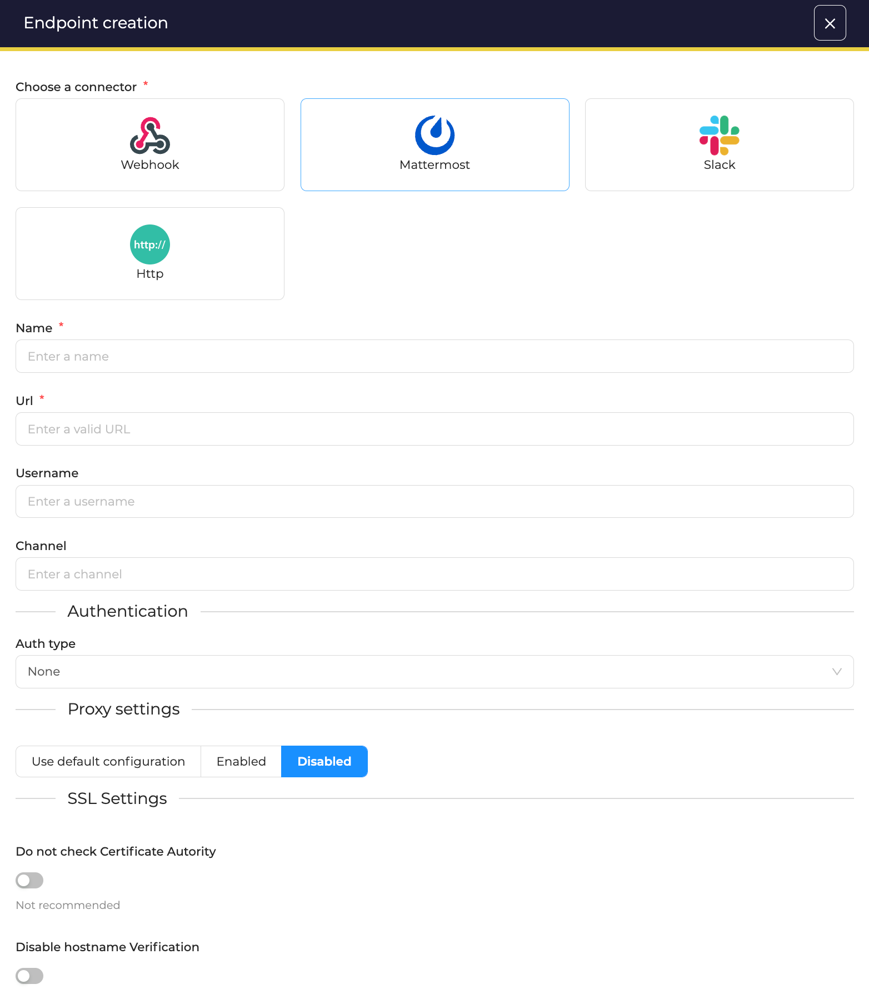

# Send notifications to a MS Teams channel

!!! Warning "Under construction" 

Using Microsoft Teams as *Notifier* requires to create at least one endpoint. This endpoint defines how TheHive will connect to MS Teams.

## Prepare Microsoft Teams

!!! Info 
    In this example, we are creating an *incoming webhook* in a dedicated channel named *thehive*.

<video width="600"  controls>
  <source id=mp4 src="../images/organisation-endpoints-msteams-configuration.mp4" type="video/mp4">
</video>

## Create an enpoint
In the *Organisation* configuration view, open the *Endpoints* tab. Then, click on the :fontawesome-regular-square-plus: button to create a new *Notifier*. 

<figure markdown>
  { width="500" }
</figure>

### Enpoint configuration
Choose *Teams* and complete required information.

<figure markdown>
  { width="500" }
</figure>

* **Name**: give a unique name to the endpoint
* **URL**: specify the URL to connect to your MS Teams ; This is the URL copied while creating the *incoming webhook* in Teams
* **Auth Type**: Use *Basic authentication* to connect to this endpoint, or use *Key* or *Bearer* method
* **Proxy settings**: choose to use a web proxy to connect to this endpoint
* **SSL settings**: disable Certificate Authority checking and/or checks on hostnames

Then, click **confirm** to create the endpoint.

## Notification configuration
When creating a *Notification* select *Mattermost* as *Notifier* and complete the form.

<figure markdown>
  { width="500" }
</figure>

TheHive uses [Handlebars](https://handlebarsjs.com) to let you build templates with input data, and this can be used in most of all fields of the form:

* **Endpoint**: choose the endpoint to use
* **Text template**: This is required, even if an adaptive card template is filled. This is used in the summary part, in notifications. Format is *plain text*.
* **Adaptive card template**:
    * Available format are: *JSON*, *Markdown* and *Plain text* 
    * Click *Add variable* to select a variable to insert in the template

!!! Tip
    You can use [https://adaptivecards.io/designer/](https://adaptivecards.io/designer/) as a starting point to design your adaptive card.

Then click **confirm** to register this *Notifier*.