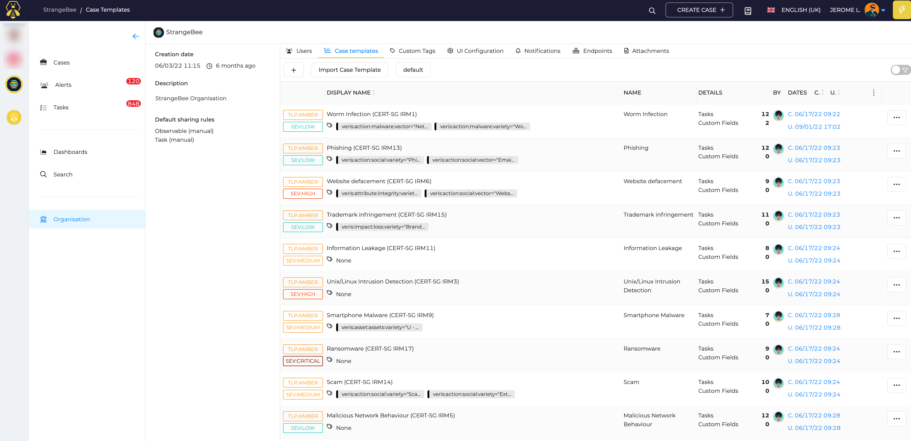
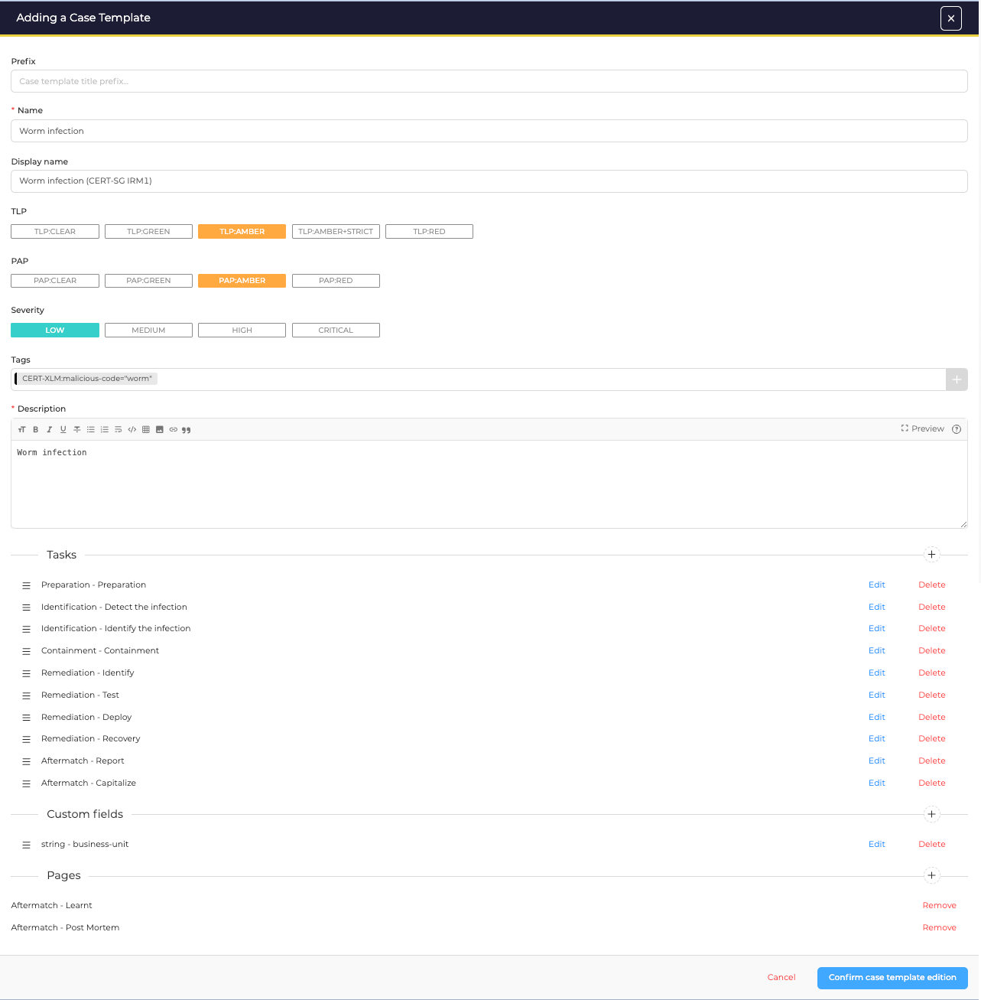
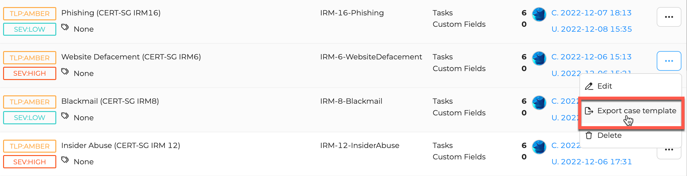
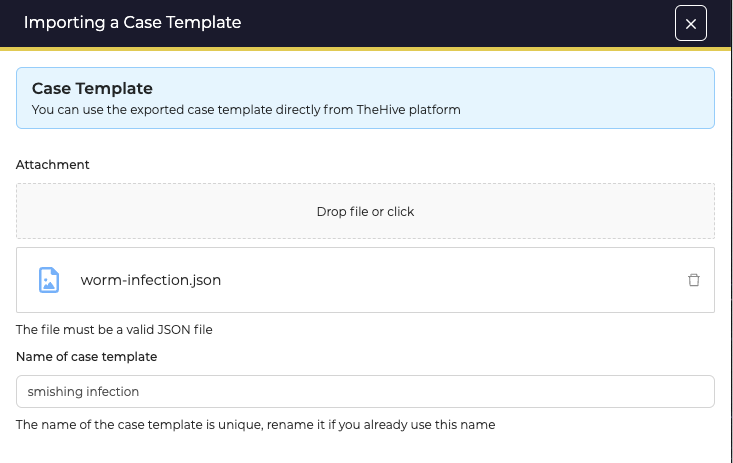

# Define Case templates

This section contains the Case templates you prepare for your organisation.

## List of Case Templates

Access to the list by opening the *Organisation* menu, then the *Templates* tab, and the *Cases* tab.

<figure markdown>
  { width="450" }
  <figcaption>List of Case templates</figcaption>
</figure>

Click the :fontawesome-regular-square-plus: button to create a new *Case template*.

## New Case template

<figure markdown>
  { width="450" }
  <figcaption>Create a case template</figcaption>
</figure>

### Configuration parameters

Prefix
  : String that will be prepended to the title of a Case when created with this template

Name
  : Name of the Case template. Used to identify the Case template with the API

Display Name
  : Name of the Case template displayed in the UI

TLP
  : Default TLP of the Case when created with this template

PAP
  : Default PAP of the Case when created with this template

Severity
  : Default Severity of the Case when created with this template

Tags
  : List of tags that will be added to the Cases created with this template

Description
  : Default description of Cases created with this template if not modified.

Tasks
  : Add tasks to the templates. They will be automatically added to the Case when created with this template

Custom Fields
  : Add Custom fields to the template. Default value can be set for Custom fields as well.

Pages
  : Add pages template to the template. They will be automatically added to the Case when created with this template

## Import/Export

#### Export a *Case template* 
*Case templates* can be exported and stored as JSON files by clicking on the option icon :fontawesome-solid-ellipsis: and selecting :fontawesome-solid-file-export: *Export case template*

<figure markdown>
{ width="500" }
<figcaption>Export a case template</figcaption>
</figure>

#### Import a *Case template*
Click on the button *Import Case Template* and select the JSON formatted file to import.

<figure markdown>
{ width="500" }
<figcaption>Import a case template</figcaption>
</figure>