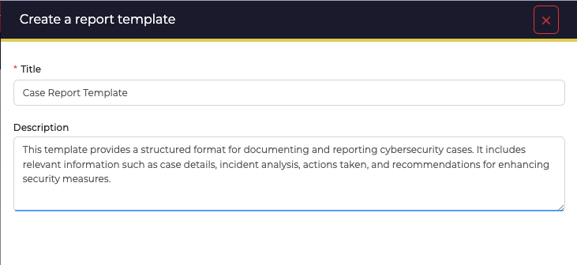
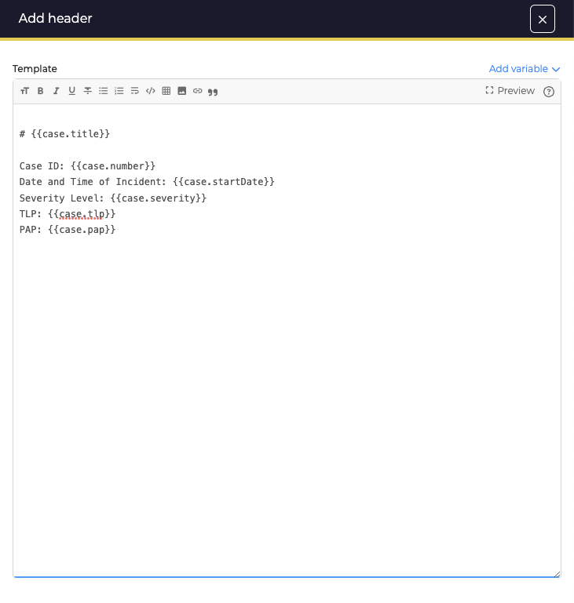
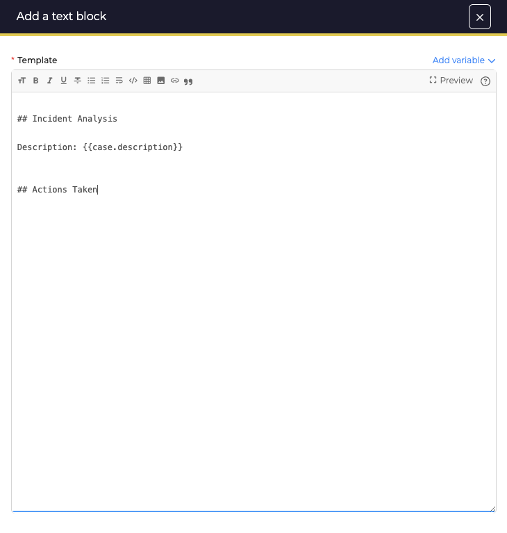
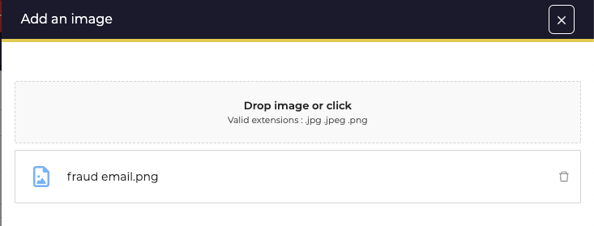
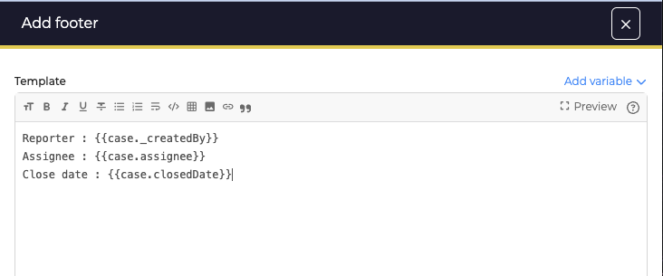
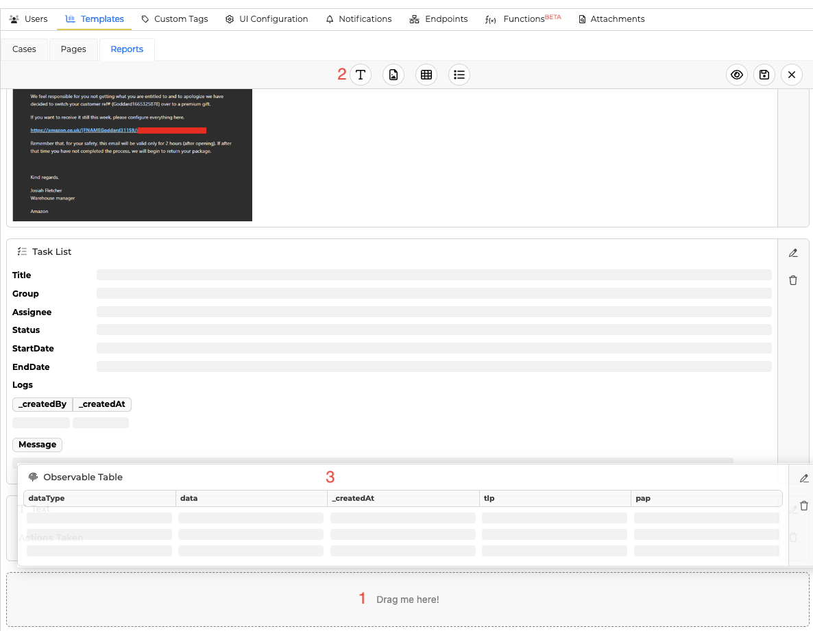
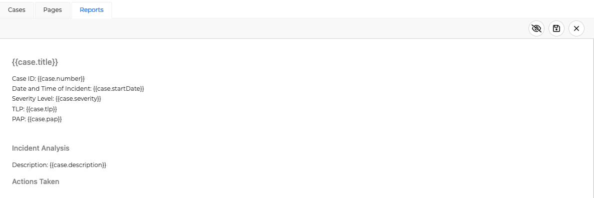

# Define Reports templates

This section contains the reports templates you prepare for your organisation.

## List of Reports Templates

Access to the list by opening the *Organisation* menu, then the *Templates* tab, and the *Reports* tab.

<figure markdown>
  { width="450" }
  <figcaption>List of reports templates</figcaption>
</figure>

Click the :fontawesome-regular-square-plus: button to create a new *Report template*.

## New Report template

<figure markdown>
  { width="450"}
  <figcaption>Create a report template</figcaption>
</figure>

### Configuration parameters

Define report title and description

Title
  : Page template title. Used to identify the Page template with the API. Also used as a page title when the template is used in a case.

Description
  : Category for grouping pages on a common theme. Is used as a page tree in the case of.

Content
  : Default page content when the page template is used in a case.

Then define the report content, consisting of a header, footer and widget list

## Header

The header is composed of markdown content. It is not mandatory to define a header.

<figure markdown>
  { width="450"}
  <figcaption>Define header</figcaption>
</figure>

## Text widget

It is possible to define a text widget to define content.
<figure markdown>
  { width="450"}
  <figcaption>Define text widget</figcaption>
</figure>

A text widget can be defined to add separating titles between widgets. 
<figure markdown>
  { width="450"}
  <figcaption>Define section title</figcaption>
</figure>

## Image widget

Add images by searching for them in computer files or by drag&drop
<figure markdown>
  { width="450"}
  <figcaption>Image widget</figcaption>
</figure>

## Table widget

Add tables containing case elements

### Parameters table

1. Define entity to select which case elements will be displayed in the table.
2. It is possible to define the maximum number of elements in the table.
3. It is possible to activate protection on the display of observables to fang information.

<figure markdown>
  { width="450"}
  <figcaption>Define entity table</figcaption>
</figure>

### Data Columns
1. When the widget is added, the most relevant information is automatically pre-selected. However, new columns can be added at any time.
2. It is also possible to redefine the order of columns using drag&drop.
3. Finally, it is possible to delete any column by clicking on the cross button of the item

<figure markdown>
  { width="450"}
  <figcaption>Define data columns table</figcaption>
</figure>

### Sorts
1. It is possible to sort table information
2. Define the data on which the table is to be filtered
3. Choose sort order
4. Add multiple sort data
5. Delete excess sort data

<figure markdown>
  { width="450"}
  <figcaption>Define sort table</figcaption>
</figure>

### Filters
1. You can add filters to the table to limit the data in the table.
2. Select any information from the selected entity
3. Define the operator to be applied to the filter
4. Define control values
5. Multiple filters can be added. 
6. To delete a filter, use the cross button.
7. Finally, you can clear all the filters to be applied

<figure markdown>
  { width="450"}
  <figcaption>Define filters table</figcaption>
</figure>

## List widget
Add list containing case elements

### Parameters list

1. Define entity to select which case elements will be displayed in the list
2. It is possible to define the maximum number of elements in the list
3. It is possible to activate protection on the display of observables to fang informations

<figure markdown>
  { width="450"}
  <figcaption>Define entity list</figcaption>
</figure>

### Data List
1. When the widget is added, the most relevant informations is automatically pre-selected. However, new datas can be added at any time
2. It is also possible to redefine the order of data using drag&drop
3. Finally, it is possible to delete any data by clicking on the cross button of the item

<figure markdown>
  { width="450"}
  <figcaption>Define data list</figcaption>
</figure>

### Sorts
1. It is possible to sort list informations
2. Define the data on which the list is to be filtered
3. Choose sort order
4. Add multiple sort data
5. Delete excess sort data

<figure markdown>
  { width="450"}
  <figcaption>Define sort list</figcaption>
</figure>

### Filters
1. You can add filters to the list to limit the data in the list
2. Select any information from the selected entity
3. Define the operator to be applied to the filter
4. Define control values
5. Multiple filters can be added 
6. To delete a filter, use the cross button
7. Finally, you can clear all the filters to be applied

<figure markdown>
  { width="450"}
  <figcaption>Define filters list</figcaption>
</figure>

## Footer
The footer is composed of markdown content. It is not mandatory to define a footer.

<figure markdown>
  { width="450"}
  <figcaption>Define footer</figcaption>
</figure>

## Organize elements
1. When a widget is added to a report, it can be dropped into the desired location.
2. It is possible to place the element at the end of the report by clicking on the desired widget button.
3. The order of widgets can be rearranged at any time.
4. Header and footer cannot be moved

<figure markdown>
  { width="450"}
  <figcaption>Organise elements</figcaption>
</figure>

## Actions on a report
1. Edit any widget in the report
2. Delete any widget except header and footer
3. Preview the report
<figure markdown>
  { width="450"}
</figure>

4. Save the report at any time
5. Exit report editing to return to report list

<figure markdown>
  { width="450"}
  <figcaption>Actions on reports</figcaption>
</figure>
