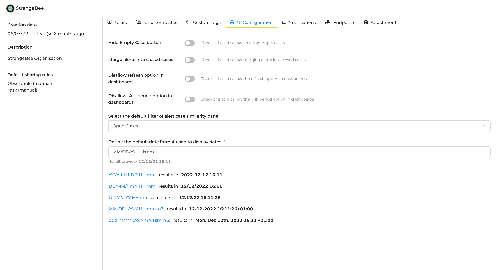
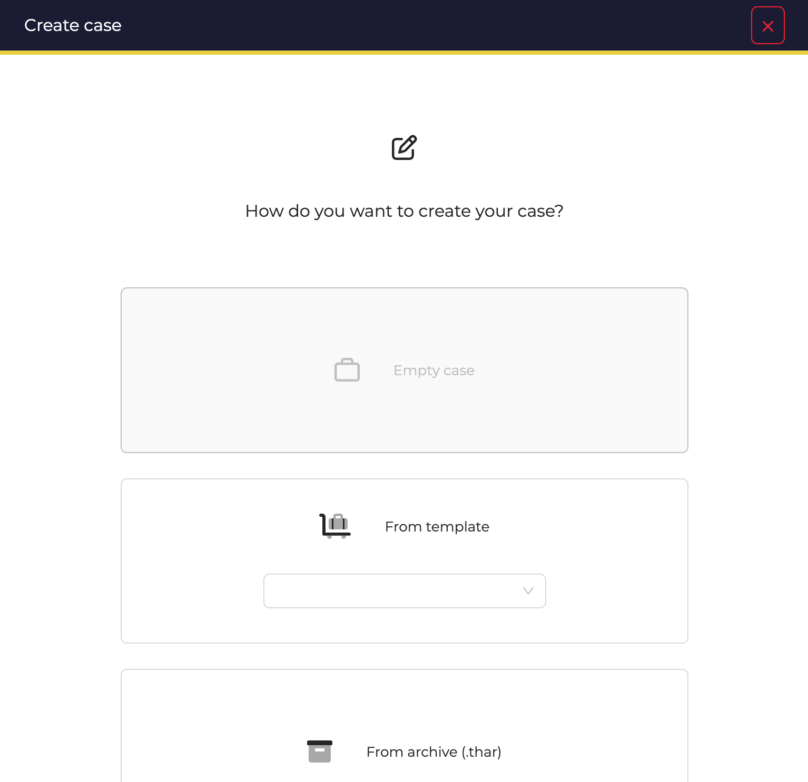
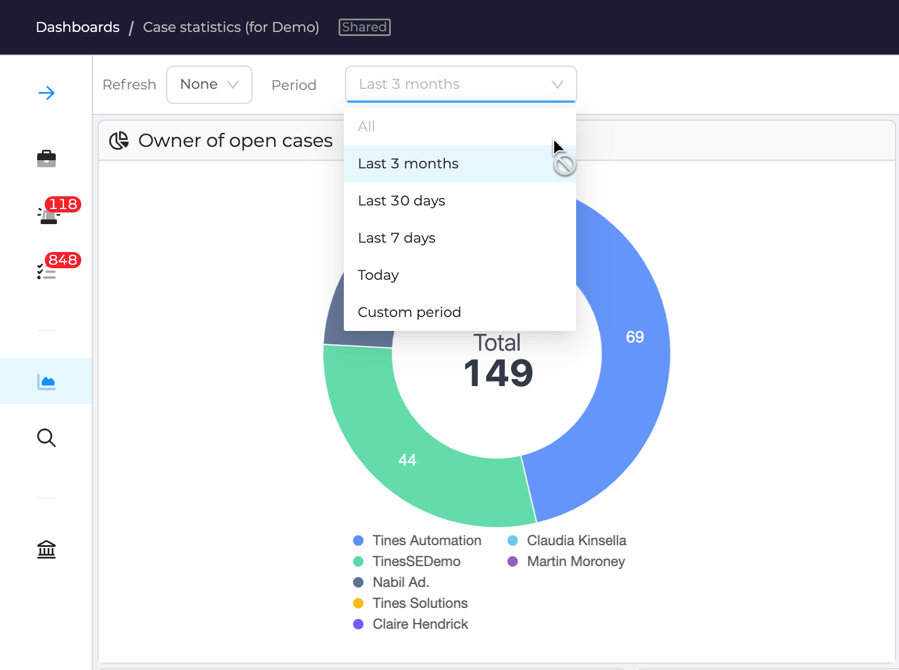
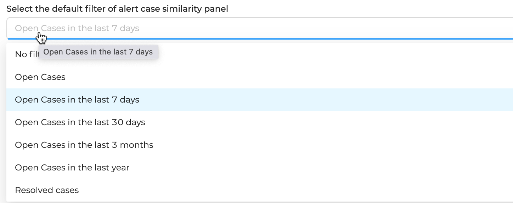
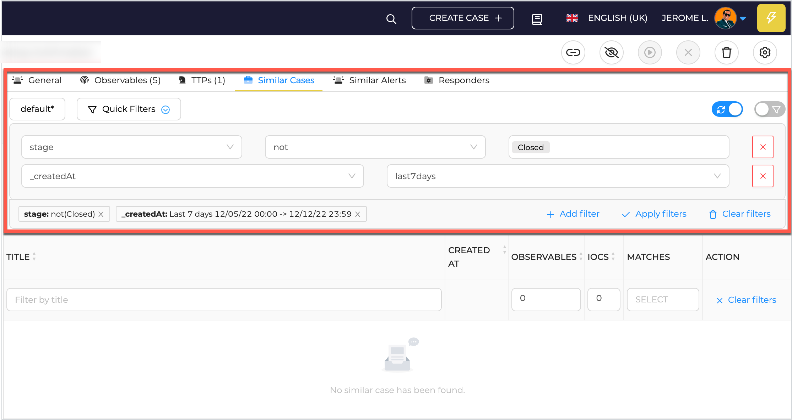

# UI configuration

At the Organisation level, few UI behaviours can be configured.

Access to the list by opening the *Organisation* menu, and the *UI Configuration* tab.

<figure markdown>
  { width="550" }
  <figcaption>UI configuration panel</figcaption>
</figure>

### Configuration parameters

**Hide Empty Case button**
  : *disabled* by default. When enabled, users from the current Organisation cannot create **empty** cases

<figure markdown>
  { width="450" }
  <figcaption>Disable Empty Case</figcaption>
</figure>

**Merge Alerts into closed cases**
  : *disabled* by default. When enabled, users from the current Organisation are allowed to choose a closed Case to merge Alerts in

**Disallow refresh option in dashboards**
  : *disabled* by default. When enabled, users from the current organisation cannot refresh dashboards

<figure markdown>
  { width="450" }
  <figcaption>Don't refresh dashboards</figcaption>
</figure>

**Disallow "All" period option in dashboards**
  : *disabled* by default. When enabled, users from the current Organisation cannot use the *All* period in dashboards

<figure markdown>
  { width="450" }
  <figcaption>Don't select period on dashboards</figcaption>
</figure>

**Select the default filter of alert case similarity panel**
  : Default filter for Similar Case tab, in the view of an Alert

<figure markdown>
  { width="450" }
  <figcaption>Select default filters for Case similarity</figcaption>
</figure>

<figure markdown>
  { width="450" }
  <figcaption>Result in Similar Cases tab in Alerts</figcaption>
</figure>

**Define the default date format used to display dates**
  : Select how you want all dates in the application are displayed to users of the current Organisaiton