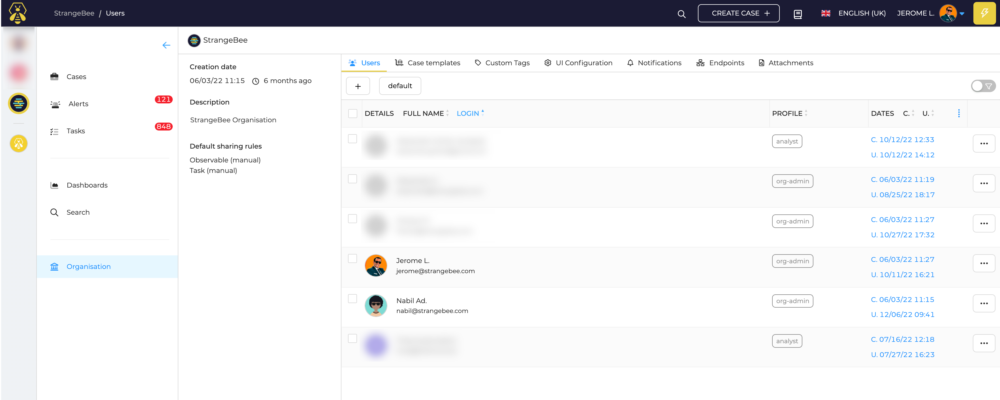

# Manage users in your Organization

!!! Info
    _org-admin_ profile or at least the permission `manageUser` is required to manage users in your organization.

## List of users

In your organization, click on _Organization_ in the menu on the left to access the list of users. The first tab is _Users_.

<figure markdown>
  { width="600" }
  <figcaption>List of user accounts</figcaption>
</figure>

## User information

To access detailed information about a user, click the _Preview_ button

<figure markdown>
  { width="450" }
  <figcaption>User information</figcaption>
</figure>

### Configuration parameters 

Avatar
  : Update the avatar associated with the user by drag&drop a new file (PNG or JPG files).

Login
  : User login

Email
  : email address for the account. This is used to send notifications or reset password links to users. _Login_ is used if no email is filled there

Type
  : Type of the account. _Normal_ or _Service_. A _Service_ account cannot open interactive session

Locked
  : Block a user from logging in the application

MFA
  : Tells if a user has configured MFA or not (_Multi Factor Authentication_). If yes, _Yes_ is displayed

API Key
  : Define, Renew, Reveal or Revoke API key of the account

Profile
  : Information about the profile given to the user

Permissions
  : List of permissions included in the profile

Password
  : Create or update the password of the user

Reset Password
  : If the application is configured with a [SMTP server](/thehive/administration/smtp.md), send an email with a magic link to the user. link is active for a short time period.

Sessions
  : List of opened interactive sessions. Click delete to close a session

## Add Users

*org-admin* users or users with the role `manageUser` in their profile can add users in the current organization. 

Click the :fontawesome-solid-plus: button to add an account in the current organization, and follow *[create an account](../../administration/accounts.md#creating-an-account)* and *[update an account](../../administration/accounts.md#updating-an-account)* guides.

## User management

Accounts can be deleted or locked, only in the current organization.
