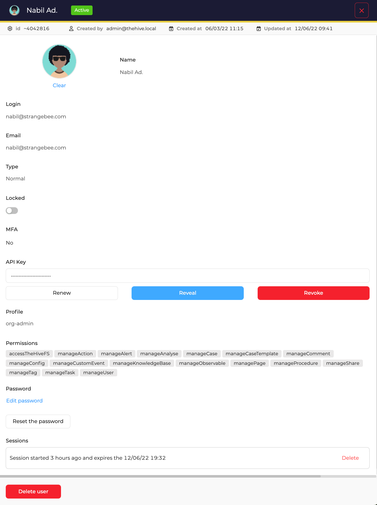

# Managing Users in Your Organization

!!! info "Required Permissions"
    Users must have the **_org-admin_** profile or at least the **`manageUser`** permission to manage users in the organization.

---

## Viewing the List of Users

To access the list of users in your organization:

1. Navigate to the **Organization** section from the left menu.
2. Click on the **Users** tab.

<figure markdown>
  { width="600" }
  <figcaption>List of user accounts</figcaption>
</figure>

---

## Viewing User Information

To access detailed information about a specific user:

1. Locate the user in the **Users** tab.
2. Click the **Preview** button.

<figure markdown>
  { width="450" }
  <figcaption>User information</figcaption>
</figure>

---

## User Configuration Parameters

- **Avatar**: Update the user's avatar by dragging and dropping a new PNG or JPG file.
- **Login**: The username used to access the system.
- **Email**: The email address associated with the account. Used for notifications and password resets. If left empty, the **Login** is used instead.
- **Type**: Specifies if the account is **Normal** or **Service**. A **Service** account cannot initiate interactive sessions.
- **Locked**: Prevents the user from logging into the application.
- **MFA (Multi-Factor Authentication)**: Indicates whether MFA is enabled for the user. If configured, **Yes** is displayed.
- **API Key**: Options to **Define**, **Renew**, **Reveal**, or **Revoke** the API key associated with the account.
- **Profile**: Displays the profile assigned to the user.
- **Permissions**: Lists the permissions included in the assigned profile.
- **Password**: Allows the creation or update of a user's password.
- **Reset Password**: If an [SMTP server](/thehive/administration/smtp.md) is configured, sends a **magic link** to reset the password. The link remains active for a limited time.
- **Sessions**: Displays active interactive sessions. Click **Delete** to close a session.

---

## Adding Users

Users with the **_org-admin_** profile or the **`manageUser`** permission can add users to the current organization.

### Steps to Add a User

1. Click the **:fontawesome-regular-square-plus:** button to create a new user account.
2. Follow the guides for **[Creating an Account](../../administration/accounts.md#creating-an-account)** and **[Updating an Account](../../administration/accounts.md#updating-an-account)**.

---

## Managing User Accounts

- Accounts **can be deleted or locked**, but only within the current organization.
- **Locked** accounts prevent the user from logging in.
