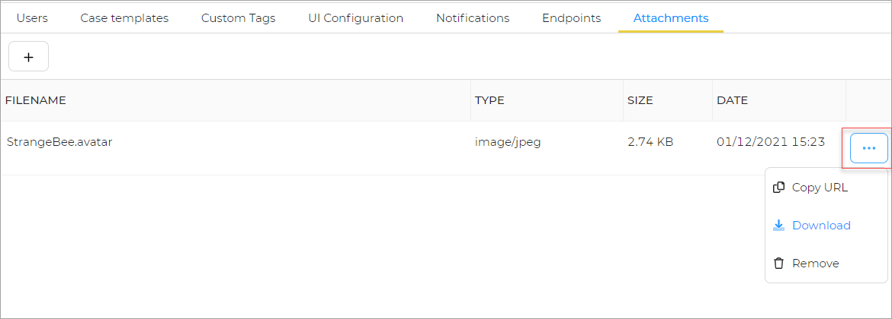

# Update Attachments

In this section you can find more information about updating Attachments . 

To copy an attachment:

1. On the attachments tab, Click the ellipsis **(...)** corresponding to the attachment to view more options.

## Copy

The **copy URL** option lets you copy the url of the attachment. 

## Download

The **download** option lets you download the attachment. 

## Remove

The **Remove** option lets you remove/delete the attachment. 
