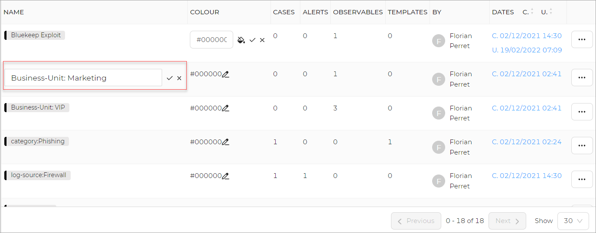
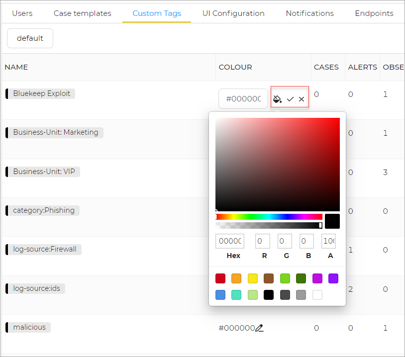

# Update Custom Tags

To update custom tags:

1. Edit the **Name** of the tag. 
1. Click the tick mark to save changes.
1. Click the cross mark to discard changes. 

To update colour of the tag:

1. Edit the **Colour** of the tag.
1. Select the colour from the pallette.
1. Click the tick mark to save changes.
1. Click the cross mark to discard changes. 

