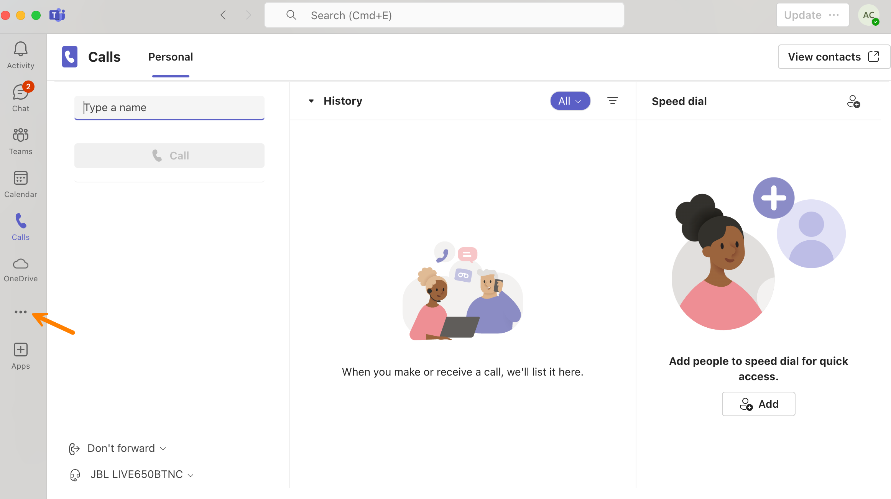
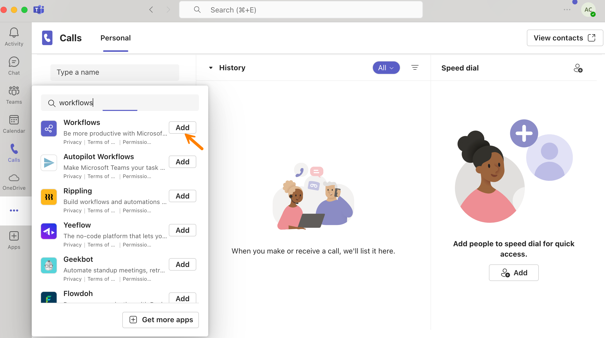

# How to Add a Local Microsoft Teams Endpoint

This topic provides step-by-step instructions for adding a local *Microsoft Teams* [endpoint](../manage-endpoints/about-endpoints.md) in TheHive.

{!includes/local-global-endpoints.md!}

{!includes/access-endpoints.md!}

<h2>Procedure</h2>

### Step 1: Create a flow in Microsoft Teams

=== "If you are using TheHive 5.4.3 or later"

    1. Go to your Microsoft Teams application.

    2. Select :fontawesome-solid-ellipsis:.

        

    3. Select the **Workflows** application.

        

    4. In the **Workflows** application, select **New flow**.

    5. Search for a template named *Post to a channel when a webhook request is received*.

    6. Select the template *Post to a channel when a webhook request is received*.

    7. Enter your flow name.

    8. Select **Next**.

    9. Select a Microsoft Teams team and channel.

    10. Select **Create flow**.

    11. Copy the HTTP POST URL.

=== "If you are using TheHive 5.4.2 or earlier"

    For TheHive versions earlier than 5.4.3, users can still send notifications to Microsoft Teams using Incoming Webhooks. This method simply requires creating a webhook and adding its URL to TheHive’s settings.

    While easy to set up, this legacy approach lacks the customization and enhanced security features provided by the newer Workflows integration. Moreover, with Microsoft deprecating Incoming Webhooks, this method may become less reliable or lose functionality in the future.

    !!! warning "Migrating to the Workflows application for Microsoft Teams integration"
        With the 5.4.3 release, TheHive has updated the Microsoft Teams notifier in response to Microsoft's deprecation of the Incoming Webhooks. Users must now migrate from the legacy webhook setup to a new configuration using the Workflows application.

    !!! info "Migration expected by January 31, 2025"
        As announced by Microsoft on [their official blog](https://devblogs.microsoft.com/microsoft365dev/retirement-of-office-365-connectors-within-microsoft-teams/), Connector owners must update their webhook URLs by January 31, 2025, to comply with the new structure. This update is crucial for maintaining seamless integration and ensuring the continued functionality of Connectors in Microsoft Teams.

    For detailed instructions, refer to Microsoft's official documentation on [creating an Incoming Webhook](https://learn.microsoft.com/en-us/microsoftteams/platform/webhooks-and-connectors/how-to/add-incoming-webhook?utm_source=chatgpt.com&tabs=newteams%2Cdotnet#create-an-incoming-webhook).

### Step 2: Create a Microsoft Teams endpoint

1. {!includes/organization-view-go-to.md!}

    ---

2. {!includes/endpoints-tab-go-to.md!}

    ---

3. Select :fontawesome-solid-plus: or **Add a new endpoint**.

    ---

4. In the **Endpoint creation** drawer, select *Teams*.

    ---

5. Enter the following information:

    **- Name**

    The endpoint name, used to identify this Microsoft Teams integration in TheHive. This name must be unique, as two endpoints can't have the same name.

    **- URL**

    The URL used to connect to your Microsoft Teams. This should be the HTTP POST URL generated by the Workflows application or Incoming Webhooks, depending on your configuration.

    ---

6. {!includes/proxy-settings.md!}

    ---

7. {!includes/certificate-authority.md!}

    ---

8. {!includes/host-name-verification.md!}

    ---

9. Select **Confirm**.

<h2>Next steps</h2>

* [Configure the Teams Notifier](../manage-notifications/notifiers/teams.md)