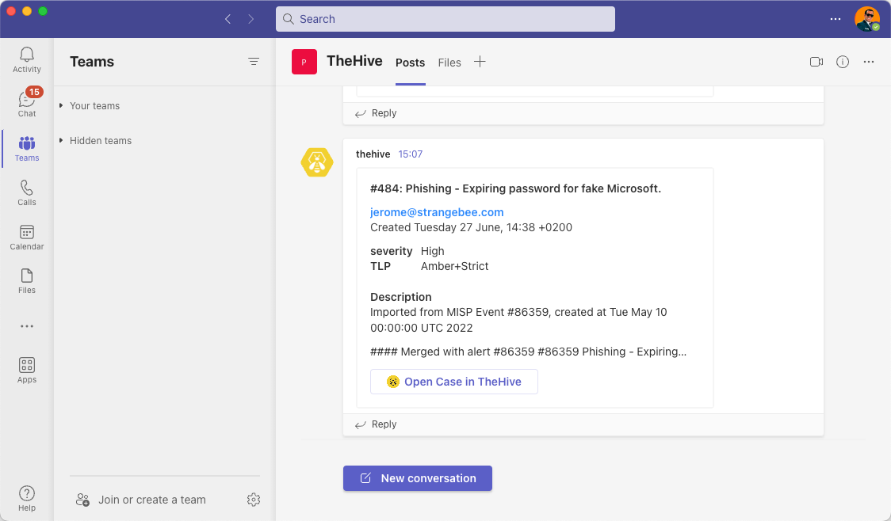

# Configure the Microsoft Teams Notifier

<!-- md:permission `manageConfig` --> <!-- md:license Platinum -->

Configure the *Microsoft Teams* [notifier](../about-notifications.md#notifiers) in TheHive to send automated notifications to Microsoft Teams channels based on specific triggers.

!!! note "Notifier availability"
    The *Microsoft Teams* notifier is available only when you turn off the **Send notification to every user in the organization** toggle and use one of the following triggers:

    * *AnyEvent*  
    * *FilteredEvent*  
    * *ActionFinished*  
    * *CaseClosed*  
    * *CaseCreated*  
    * *CaseFlagged*  
    * *CaseShared*  
    * *AlertClosed*  
    * *AlertCreated*  
    * *AlertImported*  
    * *JobFinished*  
    * *AlertObservableCreated*  
    * *CaseObservableCreated*  
    * *ObservableCreated*  
    * *TaskClosed*  
    * *TaskMandatory*

<h2>Procedure</h2>

1. 

    ---

2. 

    ---

3. Select :fontawesome-solid-ellipsis: next to the notification where you want to add the notifier, then select **Edit**.

    ---

4. Select the **Teams** notifier.

    ---

5. In the **Teams** drawer, enter the following information:

    **- Endpoint**

    Using Microsoft Teams as a notifier requires at least one endpoint. This endpoint defines how TheHive connects to Microsoft Teams.

    Endpoints can be local, defined at the organization level, or [global](../../../../../administration/add-a-global-endpoint.md), defined at the client level for one or more organizations.

    Select [the local endpoint you created](../../manage-endpoints/add-teams-endpoint.md).

    **- Text template**

    The message content to send to the Microsoft Teams endpoint.

    If an [Adaptive Card](https://adaptivecards.io/){target=_blank} template isn't provided, you must use a plain text template. In version 5.4.3, TheHive automatically converts plain text into an Adaptive Card format structured with JSON.

    !!! tips "Tips to write text templates"
        
        #### Use the Adaptive Cards Designer
        Use [the Adaptive Cards Designer](https://adaptivecards.io/designer/){target=_blank} as a starting point to design your Adaptive Cards.
        
        #### Format dates
        * TheHive uses [Handlebars string helpers](https://github.com/jknack/handlebars.java/blob/master/handlebars/src/main/java/com/github/jknack/handlebars/helper/StringHelpers.java#L507-L543){target=_blank} to read dates.
        * Formatting date and time in notifications requires using dedicated [Java patterns](https://docs.oracle.com/en/java/javase/11/docs/api/java.base/java/text/SimpleDateFormat.html){target=_blank}.

        #### Format other custom data from TheHive
        Few data custom to TheHive can be properly displayed using custom string handlers together with `object` data in notifications:

        * `tlpLabel` to display the TLP value (example: `{{tlpLabel object.tlp}}`)
        * `papLabel` to display the PAP value (example: `{{papLabel object.pap}}`)
        * `severityLabel` to display the severity value (example: `{{severityLabel object.severity}}`)

    !!! example "Adaptive Card template used to display notifications when a new case is created"

        ```json
        {
        "type": "AdaptiveCard",
        "body": [
            {
            "type": "TextBlock",
            "size": "Medium",
            "weight": "Bolder",
            "text": "#{{object.number}}: {{object.title}}",
            "horizontalAlignment": "Left",
            "spacing": "None",
            "wrap": true
            },
            {
            "type": "ColumnSet",
            "columns": [
                {
                "type": "Column",
                "items": [
                    {
                    "type": "TextBlock",
                    "weight": "Bolder",
                    "text": "{{object._createdBy}}",
                    "fontType": "Default",
                    "color": "Accent",
                    "spacing": "None"
                    },
                    {
                    "type": "TextBlock",
                    "spacing": "None",
                    "text": "Created {{dateFormat object._createdAt 'EEEE d MMMM, k:m Z' locale='en' tz='Europe/Paris'}}",
                    "isSubtle": true,
                    "wrap": true,
                    "fontType": "Default",
                    "weight": "Default",
                    "size": "Default"
                    }
                ]
                }
            ]
            },
            {
            "type": "FactSet",
            "facts": [
                {
                "title": "severity",
                "weight": "Bolder",
                "value": "{{ severityLabel object.severity}}"
                },
                {
                "title": "TLP",
                "weight": "Bolder",
                "value": "{{ tlpLabel object.tlp}}"
                }
            ]
            },
            {
            "type": "TextBlock",
            "weight": "Bolder",
            "text": "Description",
            "spacing": "Large",
            "wrap": true,
            "horizontalAlignment": "Left"
            },
            {
            "type": "TextBlock",
            "text": "{{object.description}}",
            "spacing": "None",
            "wrap": true,
            "horizontalAlignment": "Left",
            "maxLines": 3
            }
        ],
        "actions": [
            {
            "type": "Action.OpenUrl",
            "title": "Open Case in TheHive",
            "iconUrl": "https://docs.strangebee.com/images/thehive.png",
            "url": "{{url}}",
            "style": "positive"
            }
        ],
        "$schema": "http://adaptivecards.io/schemas/adaptive-card.json",
        "version": "1.5"
        }
        ```
  
    Used with the trigger *CaseCreated*, this template will create a card like this in Microsoft Teams:

    

    ---

6. Select **Confirm**.

<h2>Next steps</h2>

* [Turn Off a Notification](../turn-off-a-notification.md)
* [Delete a Notification](../delete-a-notification.md)