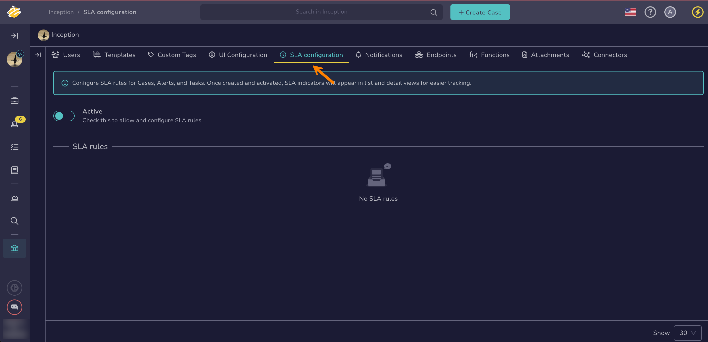
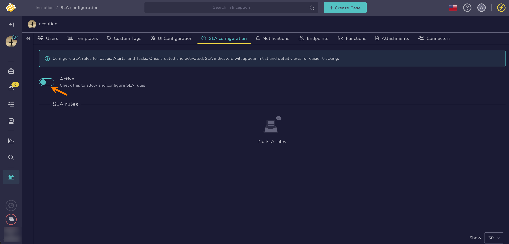
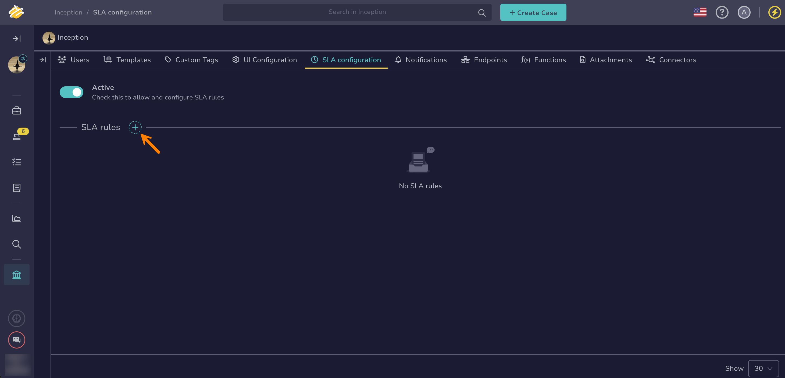
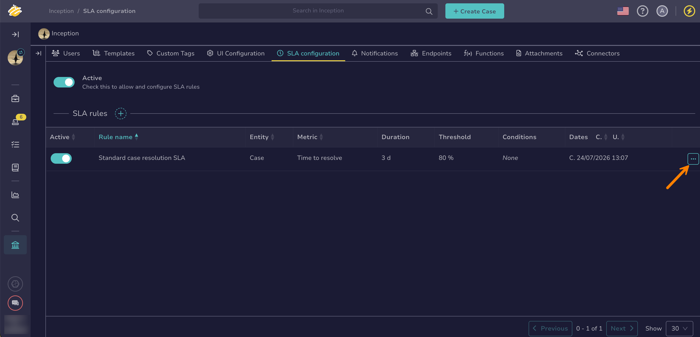
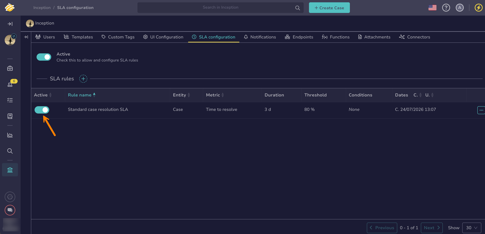

# Configure SLA Rules

<!-- md:version 5.8 --> <!-- md:license Platinum --> <!-- md:permission `manageSla` -->

Configure [service level agreement (SLA) rules](../../../sla-management/about-sla-management.md) to define response-time objectives for alerts, cases, and tasks, and turn on SLA management for the organization.

## Turn on SLA management

SLA management is turned off by default for a new organization. Rules can't be created or edited until it's turned on.

1. 

    ---

2. Select the **SLA configuration** tab.

    

3. Turn on the **Active** toggle.

    

!!! warning "Turning SLA management off"
    Turning off the **Active** toggle stops TheHive from tracking SLA compliance for the organization: the SLA column and cards disappear from list and detail views, and SLA notifications stop firing. Rules aren't deleted or forced into an inactive state—turning the toggle back on resumes tracking for rules that are still active, without having to recreate them. While the toggle is off, you can't create or edit SLA rules.

## Create an SLA rule

1. In the **SLA configuration** tab, select :fontawesome-solid-plus:.

    

2. Enter a rule name.

    The name must be unique within the organization.

3. Select the entity: **Alert**, **Case**, or **Task**.

    !!! warning "Entity type can't be changed later"
        Selecting a different entity type resets the metric type and all conditions already configured on the rule. Once the rule is saved, the entity type is locked. You must [create a separate rule](#create-an-sla-rule) instead.

4. Select the metric type the rule is measured against.

    Available metric types depend on the selected entity type. See [available metrics per entity](../../../sla-management/about-sla-management.md#how-sla-is-calculated).

5. Define the first target.

    A target combines:

    * One or more conditions that narrow which entities the target applies to. Select **Add condition** for each one. Conditions within a target are combined using the `AND` operator, meaning all of them must be met. A target with no conditions matches every entity of the rule's entity type.
    * A duration, entered as a number and a unit: *minutes*, *hours*, or *days*.
    * A warning threshold, entered as a percentage between 1% and 99% of the duration. When this percentage of the duration has elapsed, the entity's SLA status changes to *At risk*.

6. Optional: Select **Add target** to define more targets on the same rule.

    Each target is evaluated independently. If more than one target on a rule matches the same entity, TheHive applies the target with the earliest deadline.

    !!! note "Limits"
        An organization can have up to 100 SLA rules. Each rule can have up to 10 targets, and each target can have up to 10 conditions.

7. Select **Save**.

TheHive evaluates a rule every time a matching alert, case, or task is created or updated.

A new rule doesn't apply to existing alerts, cases, and tasks straight away, but it does the next time each one is updated. The SLA then counts from the entity's own metric start date, not from the moment the rule was saved.

## Edit an SLA rule

1. In the **SLA configuration** tab, next to the rule you want to edit, select :fontawesome-solid-ellipsis: and then **Edit**.

    

2. Update the rule name, metric type, or targets as needed.

    The entity type can't be changed. To measure a different entity type, [create a separate rule](#create-an-sla-rule).

3. Select **Save changes**.

Editing a rule doesn't recalculate the SLA status of entities that TheHive already evaluated under the previous version of the rule.

## Turn off an SLA rule

!!! warning "In-progress calculations lost"
    Turning off a rule's **Active** toggle loses its in-progress SLA calculations and stops its SLA indicator from appearing on matching alerts, cases, and tasks. Turn the toggle back on at any time to resume tracking.

In the **SLA configuration** tab, next to the rule, turn off the **Active** toggle.

## Delete an SLA rule

!!! danger "Immediate and irreversible"
    Deleting a rule immediately removes its SLA indicator from every alert, case, and task it previously covered. This can't be undone.

In the **SLA configuration** tab, next to the rule you want to delete, select :fontawesome-solid-ellipsis: and then **Delete**.

<h2>Next steps</h2>

* [About SLA Management](../../../sla-management/about-sla-management.md)
* [Monitor SLA](../../../sla-management/monitor-sla.md)
* [Configure SLA Notifications](../../../sla-management/configure-sla-notifications.md)
