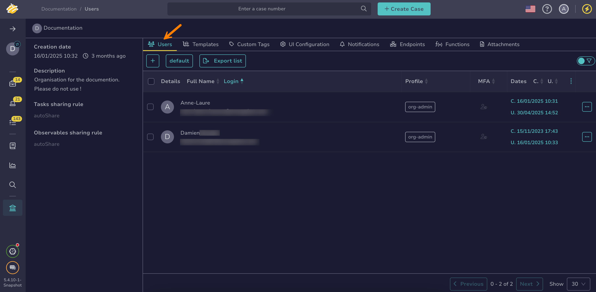
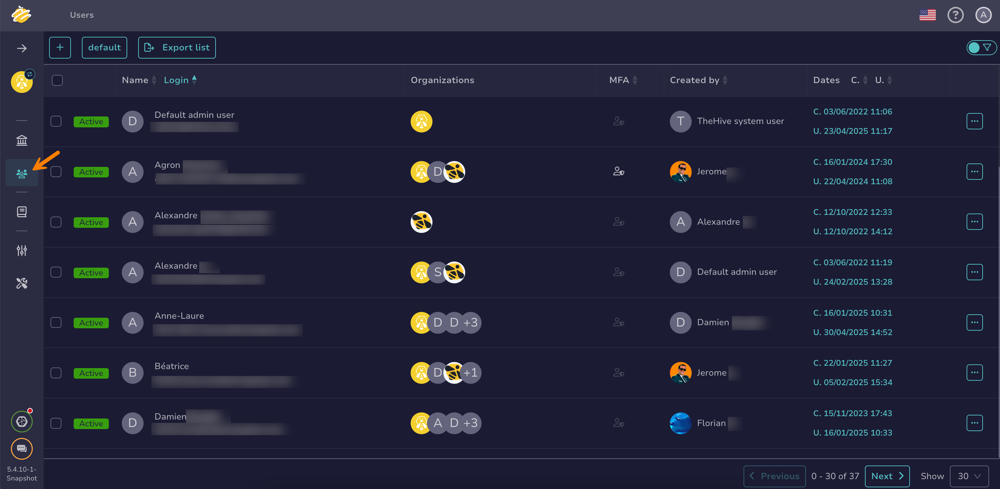

# How to Create a User Account

This topic provides step-by-step instructions for creating a [user account](about-user-accounts.md) in TheHive.

## Create a user account for an organization

### As an administrator

{!includes/administrator-access-manage-user-accounts.md!}

1. Go to the **Organizations** view from the sidebar menu.

     

2. Select the organization to add the user account to, then select :fontawesome-solid-plus:. Alternatively, hover over the organization, select :fontawesome-solid-eye:, and select **Add** in the **Users** section.

3. In the **Adding a user** drawer, enter:

    **- Type \***

    The user account type you want to create.

    Pick an option from the dropdown list:   
        - *Normal*: Intended for users who access TheHive through the web interface. Normal accounts support all authentication methods. These accounts can also generate API keys if enabled. 
        - *Service*: Designed for programmatic access to TheHive via the API. Service accounts are typically used for automation tasks, such as creating alerts. They authenticate exclusively using an API key and can't sign in to the web interface.

    **- Login \***

    The login used for the user to sign in. It can be an email address or another identifier, depending on [your authentication configuration](../../../../administration/authentication/configure-authentication.md).

    **- Name \***

    The user account's display name.

    **- Profile \***

    Select a [permission profile](../../../../administration/profiles.md) for the user account from the dropdown list.

{!includes/create-a-user-account.md!}

### As an organization administrator

{!includes/access-manage-user-accounts.md!}

1. Go to the **Organization** view from the sidebar menu.

    

2. Select the **Users** tab.

    

3. Select :fontawesome-solid-plus:.

4. In the **Adding a user** drawer, enter:

    **- Type \***

    The user account type you want to create.

    Pick an option from the dropdown list:   
        - *Normal*: Intended for users who access TheHive through the web interface. Normal accounts support all authentication methods. These accounts can also generate API keys if enabled. 
        - *Service*: Designed for programmatic access to TheHive via the API. Service accounts are typically used for automation tasks, such as creating alerts. They authenticate exclusively using an API key and can't sign in to the web interface.

    **- Login \***

    The login used for the user to sign in. It can be an email address or another identifier, depending on [your authentication configuration](../../../../administration/authentication/configure-authentication.md).

    **- Name \***

    The user account's display name.

    **- Profile \***

    Select a [permission profile](../../../../administration/profiles.md) for the user account from the dropdown list.

{!includes/create-a-user-account.md!}

## Create a user account for multiple organizations

{!includes/administrator-access-manage-user-accounts.md!}

1. Go to the **Users** view from the sidebar menu.

    

2. Select :fontawesome-solid-plus:.

3. In the **Adding a user** drawer, enter:

    **- Type \***

    The user account type you want to create.

    Pick an option from the dropdown list:   
        - *Normal*: Intended for users who access TheHive through the web interface. Normal accounts support all authentication methods. These accounts can also generate API keys if enabled. 
        - *Service*: Designed for programmatic access to TheHive via the API. Service accounts are typically used for automation tasks, such as creating alerts. They authenticate exclusively using an API key and can't sign in to the web interface.

    **- Login \***

    The login used for the user to sign in. It can be an email address or another identifier, depending on [your authentication configuration](../../../../administration/authentication/configure-authentication.md).

    **- Name \***

    The user account's display name.

    **- Profile \***

    Select a [permission profile](../../../../administration/profiles.md) for the user account from the dropdown list.

5. Select **Confirm**.

6. In the user accounts list, hover over the user you just created and select :fontawesome-solid-eye:.

7. Optional: Select the default user account image to modify it, then upload a new image.

8. Optional: If the login isn't an email, add an email address in the **Email** field.

9. Optional: Select **Create** to generate an API key.

10. Select **Set a new password** to create a default password for the user account.

11. Select **Confirm**.

## Creating an Account

To create a new account, follow these steps:

1. Click the :fontawesome-solid-plus: button to add an account.

   

2. Select the account type, either *Normal* or *Service*.
3. Enter a login name formatted as an *email address*.
4. Provide a name for the account.
5. Assign organizations and set an associated profile for each. To establish the default organization, click *Set as default*.

Once completed, click *Confirm*.

## Updating an Account

To modify an existing account:

1. In the account list, click *Preview* to open the account details.

   

2. You can add an avatar to the account by clicking the :fontawesome-solid-circle-question: icon and selecting a file.[^1]
3. Update the email address, which is used for notifications and password resets.
4. Verify if the user has enabled MFA (Multi-Factor Authentication).
5. To change the account password, click *Set a new password*. An email informing the user of the change is sent to their registered email address.
6. Click *Reset the password* to email the user a magic link for password reset. For more information, refer to [Password Reset Guide](./../user-guides/forgot-password.md).
7. Update *Roles* and *Organizations* as needed.
8. To delete the account, select the *Delete* option.

## License Management for User Profiles (Version 5.4.3 Update)

In version 5.4.3, TheHive introduces a new feature for license management in user profiles. During user creation or editing, administrators can now see which profiles require a license, as indicated by a **"License Required"** label in the profile selection dropdown. This label, displayed next to profiles with permissions that consume licenses, helps administrators manage license usage effectively.

This enhancement is available in both the **Org-admin** and **Global Users** views, providing consistent visibility across user management settings.

