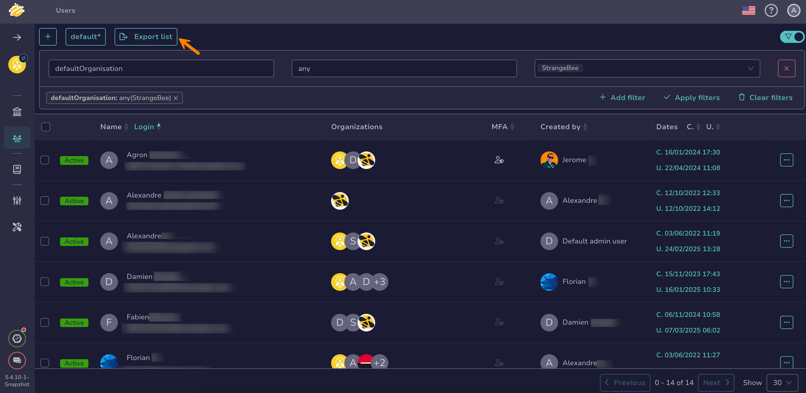
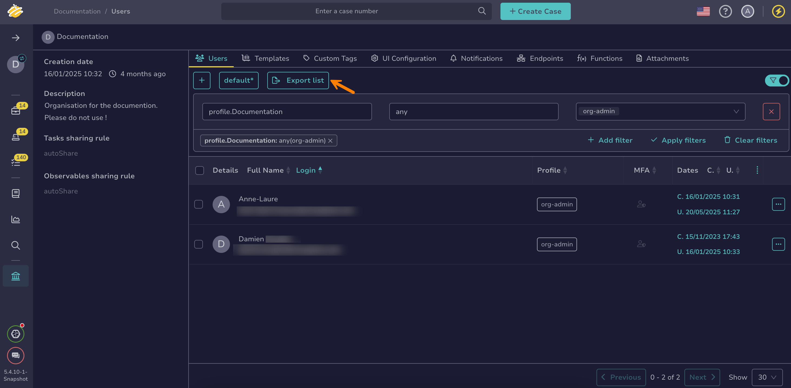

# Export a List of User Accounts

This topic provides step-by-step instructions for exporting a list of [user accounts](about-user-accounts.md) in TheHive.

## Export a list of user accounts at the client level

<!-- md:permission `[admin] manageUser` -->

1. 

2. Select **Export list** to export all displayed user accounts, reflecting the applied [filters and sorting](../../../analyst-corner/about-filtering-and-sorting.md). To export a specific selection of user accounts, select :fontawesome-regular-square: next to the user accounts you want to export, then select **Export selection**.

    

3. In the **Export users to file** drawer, select your preferred formatting options.

4. Select **Export to file**.

## Export a list of user accounts for an organization

<!-- md:permission `manageUser` -->

1. 

2. 

3. Select **Export list** to export all displayed user accounts, reflecting the applied [filters and sorting](../../../analyst-corner/about-filtering-and-sorting.md). To export a specific selection of user accounts, select :fontawesome-regular-square: next to the user accounts you want to export, then select **Export selection**.

    

4. In the **Export users to file** drawer, select your preferred formatting options.

5. Select **Export to file**.

<h2>Next steps</h2>

* [Create a User Account](create-a-user-account.md)
* [Delete a User Account](delete-a-user-account.md)
* [Lock a User Account](lock-a-user-account.md)
* [Manage User Accounts](manage-user-accounts.md)
* [Add or Remove an Existing User Account from an Organization](../../../../administration/organizations/add-remove-an-existing-user-account-from-an-organization.md)