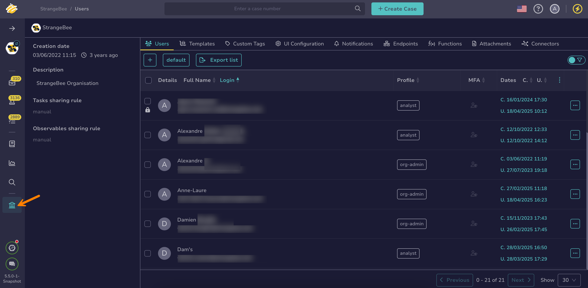

# How to Manage User Accounts

This topic provides step-by-step instructions for managing [user accounts](about-user-accounts.md) in TheHive.

=== "As an administrator"

    !!! warning "Required permissions"
        Only users with an admin-type profile that has the `manageUser` permission can manage user accounts at the client level in TheHive.

    1. Go to the **Users** view from the sidebar menu.

        

    2. Locate the user account you're looking for, hover over it, and select :fontawesome-solid-eye:.

        !!! tip "Can't find a user account?"
            You can apply [filters and sorting](/thehive/user-guides/analyst-corner/about-filtering-and-sorting/) to help locate user accounts. These preferences can be saved using [views](../../../analyst-corner/about-views.md).

=== "As an organization administrator"

    !!! warning "Required permissions"
        Only users with the `manageUser` permission can manage user accounts at the organization level in TheHive.

    1. Go to the **Organization** view from the sidebar menu.

        

    2. Select the **Users** tab.

        

    3. Locate the user account you're looking for, hover over it, and select :fontawesome-solid-eye:.

        !!! tip "Can't find a user account?"
            You can apply [filters and sorting](../../../analyst-corner/about-filtering-and-sorting.md) to help locate user accounts. These preferences can be saved using [views](/thehive/user-guides/analyst-corner/about-views/).

## Manage a user account email

Use this field when the login isn’t an email address or when you want to set a different email. The email address is used to send notifications and password-related information to the user.

Update the email address and select **Confirm**.

## Edit a user account avatar

Select the avatar, then select a new image in PNG or JPG format. The file must be smaller than 500 KB. Select **Confirm** to apply the change.

## Check whether a user account has activated multi-factor authentication (MFA)

Move through the **MFA** section. If the user has activated multi-factor authentication, *Yes* appears.

## Edit a user account permission profile

Move through the **Organizations** section and update the [permission profile](../../../../administration/profiles/about-profiles.md) for the relevant organizations. Select **Confirm** to apply the change.

## Manage a user account API key

Move through the **API key** section and select **Renew**, **Reveal**, or **Revoke**, depending on the action you want to take. Select **Confirm** to apply the change.

## Delete a user account session

Move through the **Sessions** section and select **Delete** next to the session you want to delete. This logs the user out of the TheHive interface.

## Edit a user account password

The password edit feature is available only if an [SMTP server](../../../../administration/smtp/configure-smtp-server.md) is configured.

Move through the **Password** section and select **Edit password**. Select **Confirm** to apply the change. You must send the new password to the user via a secure channel.

## Reset a user account password

The password reset feature is available only if an [SMTP server](../../../../administration/smtp/configure-smtp-server.md) is configured.

Move through the **Password** section and select **Reset password**. The user gets an email asking them to choose a new password. The link is only valid for a limited time.

<h2>Next steps</h2>

* [Create a User Account](create-a-user-account.md)
* [Delete a User Account](delete-a-user-account.md)
* [Lock a User Account](lock-a-user-account.md)
* [Export a List of User Accounts](export-list-user-accounts.md)
* [Add or Remove an Existing User Account from an Organization](../../../../administration/organizations/add-remove-an-existing-user-account-from-an-organization.md)