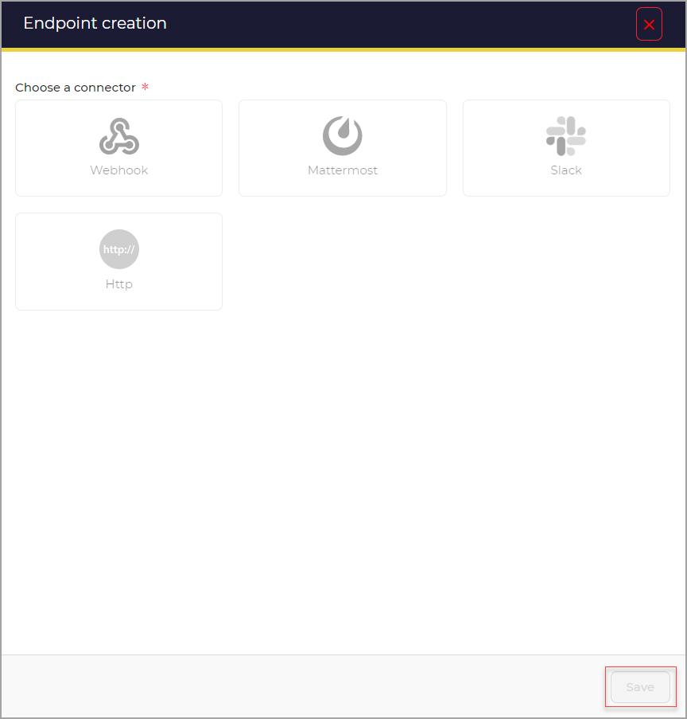

# Add endpoints

A user can create an endpoint. 

To Add an Endpoint:

1. Click the **+** button or Click the Add a new endpoint link.

A new page opens.

1. Select the connector.
2. Click the **Save** button.

