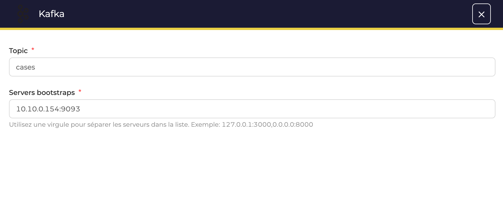
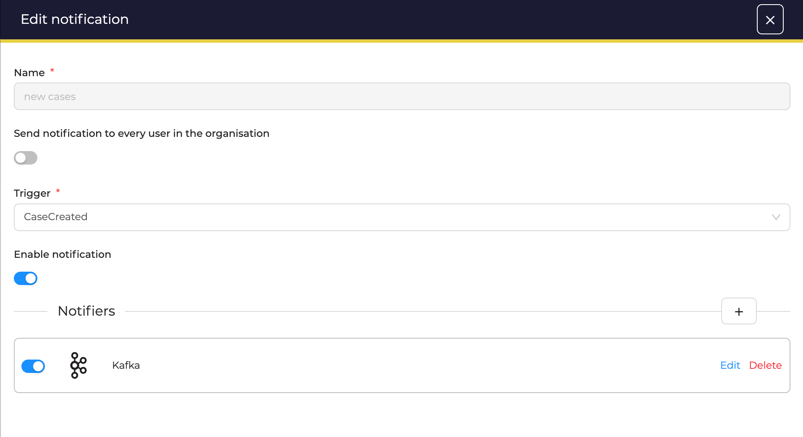

# Send notifications to Kafka

!!! Info
    * No endpoint definition is required to send data to a *topic* in Kafka

## Configuration

* When creating a *Notification* select *Kafka* as *Notifier* and complete the form with: 
  * The Topic used in Kafka
  * The *IP address/homstname* and *port* to connect

<figure markdown>
  { width="500" }
</figure>

* Then, add other notifiers by clicking on the :fontawesome-regular-square-plus: button, or click **confirm** to create the *Notification*

<figure markdown>
  { width="500" }
</figure>
