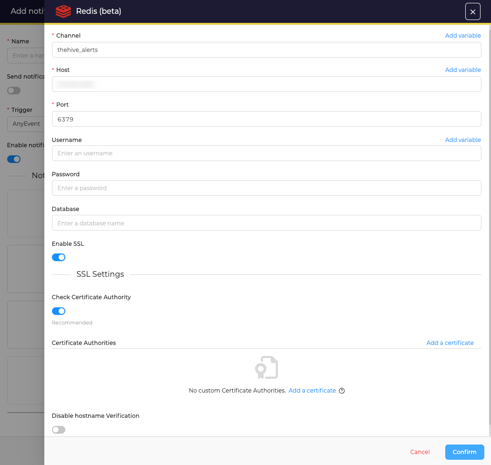

# Send notifications to Kafka

!!! Info
    * No endpoint definition is required to send data to a database in Redis

## Configuration

Start by clicking on the :fontawesome-regular-square-plus: button to create an new notification.

<figure markdown>
  { width="500" }
</figure>

Then select *Redis* as *Notifier* and complete the form with: 

<figure markdown>
  { width="500" }
</figure>

  * The Channel name used in Redis
  * The *IP address/homstname* and *port* to connect
  * A Username
  * A password
  * A database name
  * SSL settings and custom Certificate Authorities can also be configured

Then click **confirm** to create the *Notification*.