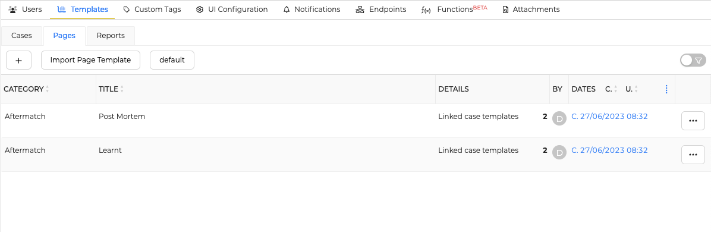
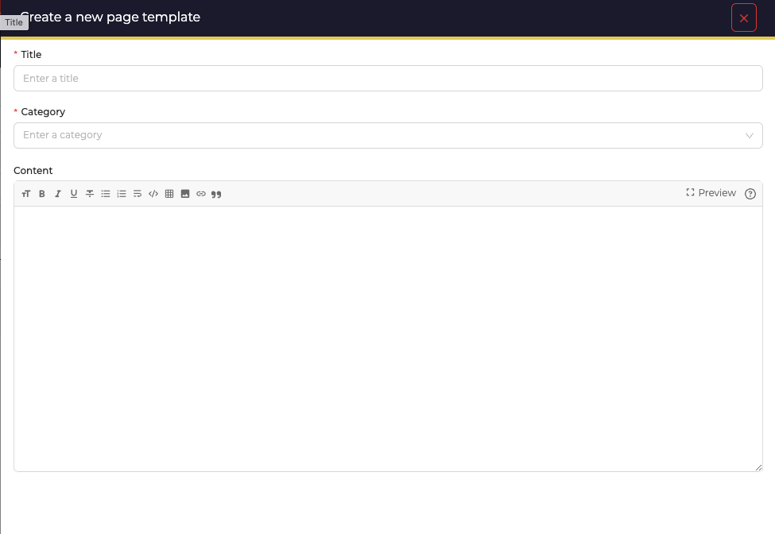
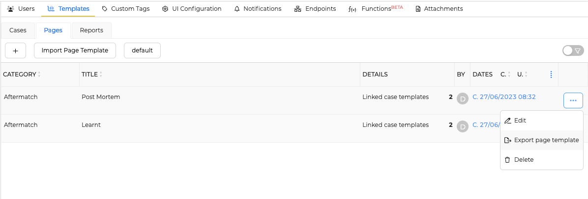
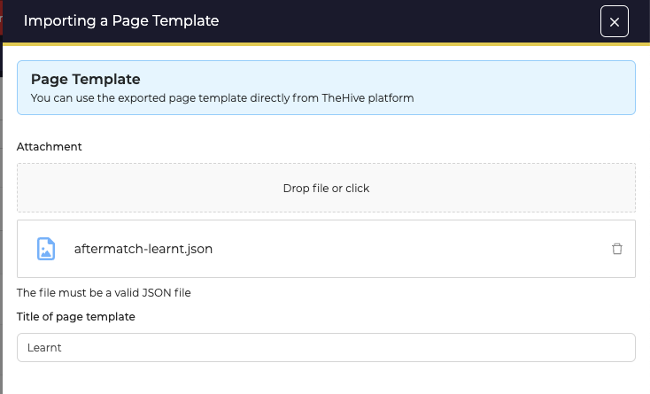

# Define Page templates

This section contains the Page templates you prepare for your organisation.

## List of Page Templates

Access to the list by opening the *Organisation* menu, then the *Templates* tab, and the *Pages* tab.

<figure markdown>
  { width="450" }
  <figcaption>List of Pages templates</figcaption>
</figure>

Click the :fontawesome-regular-square-plus: button to create a new *Page template*.

## New Page template

<figure markdown>
  { width="450"}
  <figcaption>Create a page template</figcaption>
</figure>

### Configuration parameters

Title
  : Page template title. Used to identify the Page template with the API. Also used as a page title when the template is used in a case.

Category
  : Category for grouping pages on a common theme. Is used as a page tree in the case of.

Content
  : Default page content when the page template is used in a case.

## Import/Export

#### Export a *Page template* 
*Page templates* can be exported and stored as JSON files by clicking on the option icon :fontawesome-solid-ellipsis: and selecting :fontawesome-solid-file-export: *Export page template*

<figure markdown>
{ width="500" }
<figcaption>Export a page template</figcaption>
</figure>

#### Import a *Page template*
Click on the button *Import Page Template* and select the JSON formatted file to import.

<figure markdown>
{ width="500" }
<figcaption>Import a page template</figcaption>
</figure>