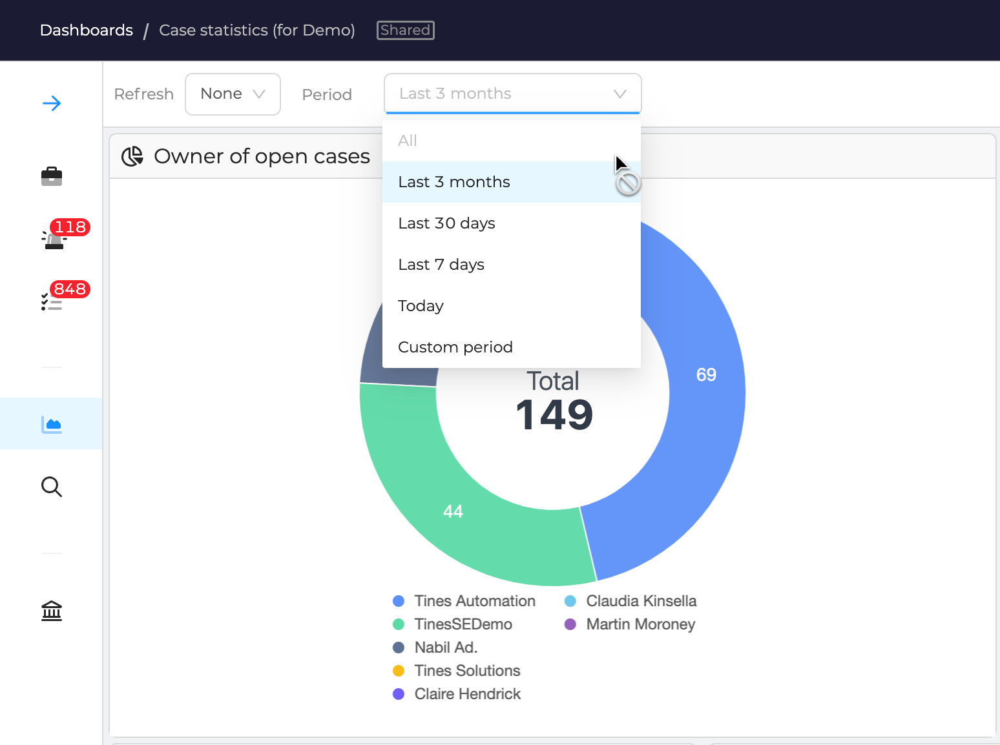

# UI Configuration

At the **organization level**, several **UI behaviors** can be configured to tailor the user experience.

To access these settings:

1. Open the **Organization** menu.
2. Navigate to the **UI Configuration** tab.

<figure markdown>
  { width="550" }
  <figcaption>UI Configuration Panel</figcaption>
</figure>

---

## UI Configuration Parameters

### **Hide Empty Case Button**
- **Default:** *Disabled*  
- **Effect:** When enabled, users **cannot create empty cases**. They must choose between:
  - Creating a **case using a template**.
  - Creating a **case from an archive**.

<figure markdown>
  { width="450" }
  <figcaption>Disable Empty Case</figcaption>
</figure>

---

### **Merge Alerts into Closed Cases**
- **Default:** *Disabled*  
- **Effect:** When enabled, users can merge **alerts into closed cases**.

---

### **Disallow Refresh Option in Dashboards**
- **Default:** *Disabled*  
- **Effect:** When enabled, users **cannot refresh dashboards**.
- **Use Case:** Helps mitigate **performance issues** when multiple users interact with the UI.

<figure markdown>
  { width="450" }
  <figcaption>Disable Dashboard Refresh</figcaption>
</figure>

---

### **Disallow "All" Period Option in Dashboards**
- **Default:** *Disabled*  
- **Effect:** When enabled, users **cannot use the "All" time period filter** in dashboards.
- **Use Case:** Useful for **improving performance** when handling large datasets.

<figure markdown>
  { width="450" }
  <figcaption>Disable "All" Period in Dashboards</figcaption>
</figure>

---

### **Select the Default Filter for Alert Case Similarity Panel**
- **Effect:** Defines the **default filter** used in the **Similar Case** tab when viewing an alert.

<figure markdown>
  { width="450" }
  <figcaption>Default Filter for Case Similarity</figcaption>
</figure>

<figure markdown>
  { width="450" }
  <figcaption>Result in Similar Cases Tab in Alerts</figcaption>
</figure>

---

### **Define the Default Date Format**
- **Effect:** Allows selecting the **default format** for displaying dates across the organization.

---
